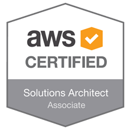
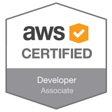

August 2018 was a very productive month to me, where after some intense dog hours studying like crazy and practicing a lot - I was able to get certified in two of the most interesting AWS exams: [Solutions Architect](https://aws.amazon.com/certification/certified-solutions-architect-associate) and [Developer Associate](https://aws.amazon.com/certification/certified-developer-associate).

That was quite of a challenge to me, because my Cloud background had been up to that point mainly focused on Oracle Cloud. It was interesting to see the differences between the two Cloud vendors, as well as seeing how AWS structures its services. Which BTW is amazing.

I certainly look forward to continue my certification path, so I can eventually try the professional ones. But these two certifications helped me to have a more in-depth understanding of how to discuss infrastructure and development on top of AWS.

Time to celebrate 🍺
