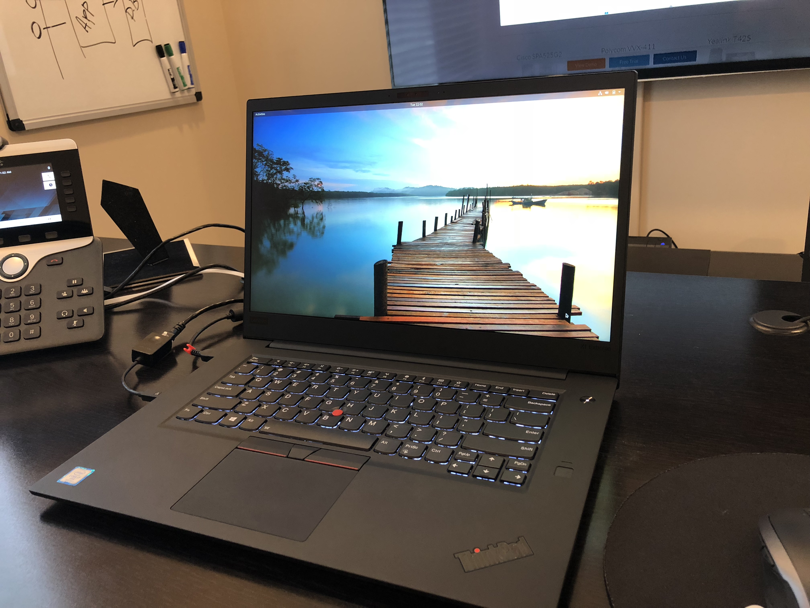
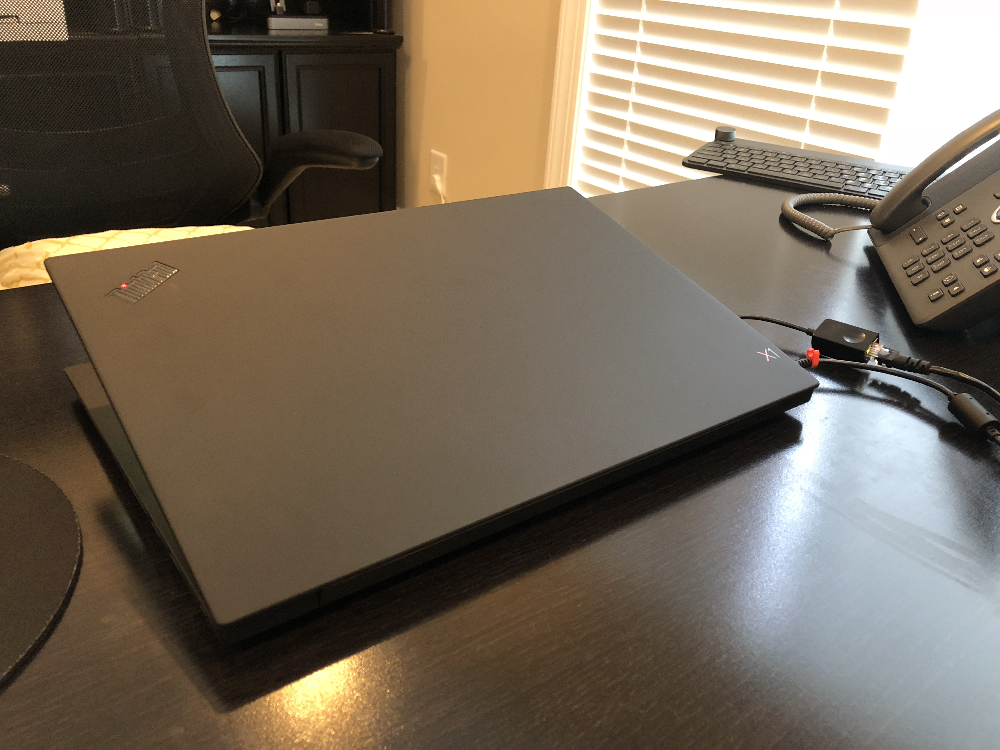
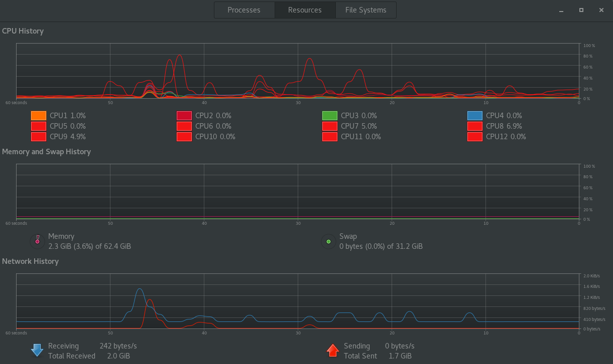

"It's not a laptop. It's a ThinkPad." - I really like this slogan because it helps to explain why I took the decision to buy the new ThinkPad X1 Extreme from Lenovo, while there are some good options out there - presumably better ones. But let's start from the beginning.

I have been working with IT for quite some time now, and for some reason I have never had a laptop of my own. Instead, I always used the laptops given by the companies I worked for. This is not a bad decision per-se, but in the long run you may find yourself disappointed with the whole keep-moving-things-around every time you change jobs.

Yes... I know that there are some neat storage solutions out there that I could use to minimize this pain. And yes, I know what Cloud is. However, I am not talking strictly about files. I am talking about the whole time you devote in setting up an laptop for your own needs, such as fine tuning, hardware upgrades, home configuration, travel configuration, etc.

That is why I decided to treat myself with a new laptop. And I call this treat because I decided not to save money on this new laptop, and wanted the best out there. And after some serious digging, I have decided to go for the [ThinkPad X1 Extreme](https://www.lenovo.com/us/en/laptops/thinkpad/thinkpad-x/ThinkPad-X1-Extreme/p/22TP2TXX1E1). Isn't a cheap laptop by far, but it delivers what you have paid for. In my case, I build a model with 64GB of RAM, 1 TB of Solid-State-Disk, Core i7 vPro Processor 8th Generation with 12 cores, NVIDIA GeForce GTX 1050 Ti 4 GB and of course: lots of Thunderbolts 3 ports.

This laptop is not only the fastest I have ever seen, but it is also very thin and quiet. And though a few people might argue that the MacBook Pro is nicer - I can confidently say that it doesn't deliver the same performance of this laptop, nor the same price/value/configuration ratio.

It came with Windows 10 pre-installed, which I rapidly got rid of it and installed Fedora 28 instead. It was not easy, but after some troubleshooting regarding the NVIDIA GeForce drivers, I got this beast up-and-running. It is simply beautiful to see =)

I am really excited to start running some heavy workloads on this laptop, perhaps even using it to demonstrate some of the cool features of Apache Kafka.
