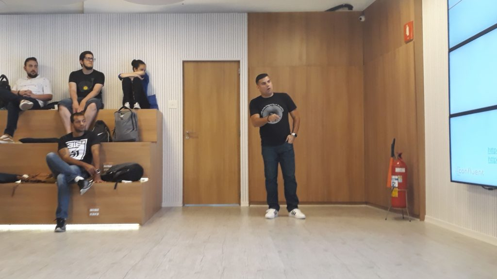
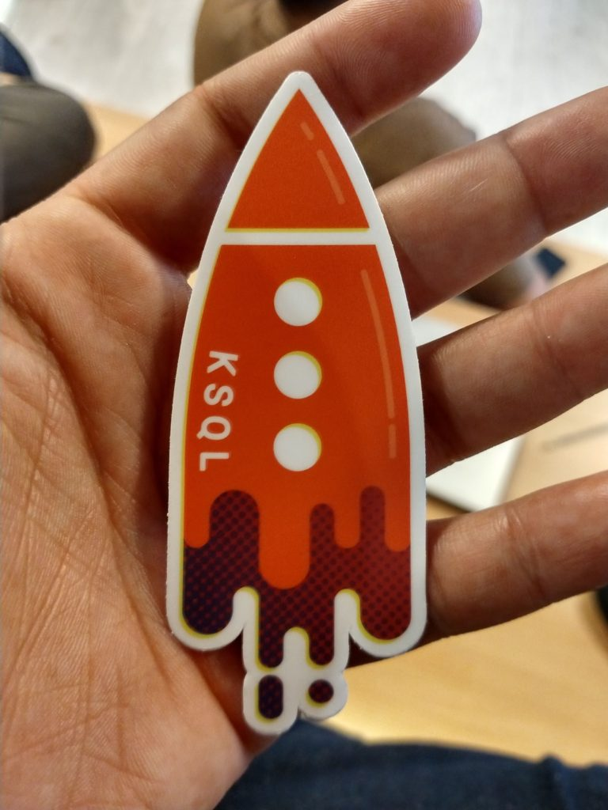
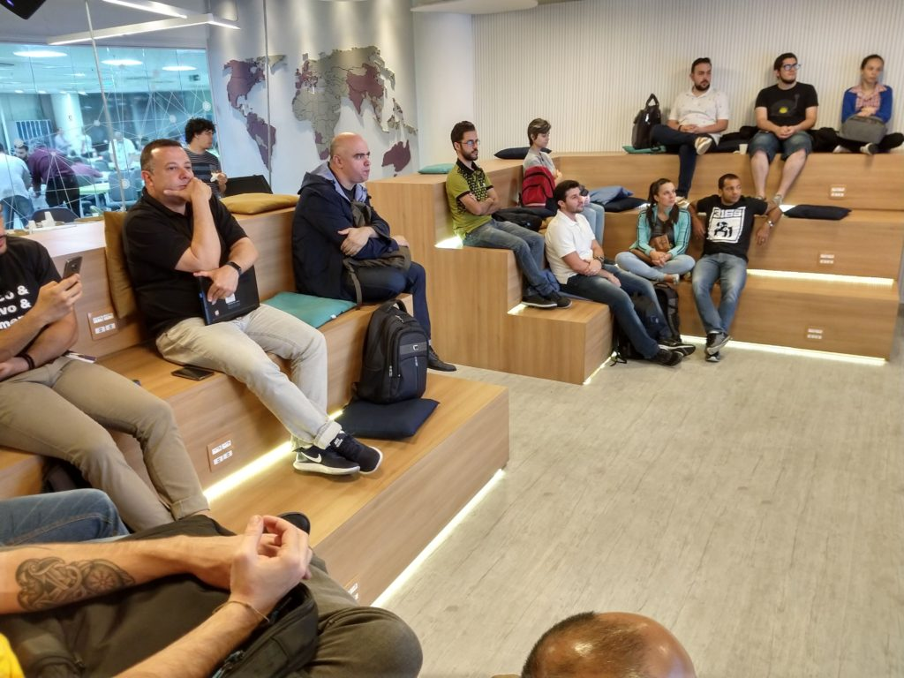
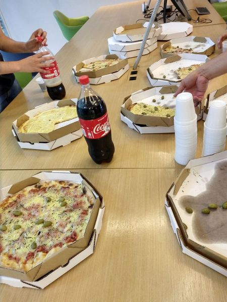

During the week of Dec 2th I had the pleasure of visiting São Paulo/Brazil, a place that I once called home. It has been almost 5 years that I left that city to live abroad -- and every time I go there its inevitable not to miss certain things.

I went down there to participate of the [Google Cloud Summit](https://cloudplatformonline.com/2018-Summit-Sao-Paulo.html) event, and make sure that developers using GCP would be aware of Confluent's Apache Kafka as a service know as [Confluent Cloud](https://www.confluent.io/confluent-cloud). It was amazing to share this information with them, since most of them was working (or planning to work) with huge amounts of data in the Cloud and Kafka is certainly _the right way_ to do it.

But what would be the value of a Developer Advocate that speaks Portuguese and visits Brazil that not gives a talk in a local meetup, right? Hence why I used my time there to give a presentation in what was the #1 official Apache Kafka meetup in the region. And boy... the results couldn't be better.

Not only I've meet nice and smart people (hey, this is Brazil we're talking about, nothing new here) but I was surprised with the amount of great use cases I have found in there. People using Kafka in lots of cool ways, whether if is to handle high volume of data or; by using some of the cool stuff that we have been working on lately such as Connect, Streams API and KSQL.

But what I was really surprised is how some people are truly using Kafka as a persistent storage and _single-source-of-truth of data_ , as a layer that holds data before delivering to the external systems. This is the proof that Brazil is certainly of the countries that we should invest more time: they literally got the point of what a [Streaming Data Platform](https://www.confluent.io/blog/stream-data-platform-1) is.

The meetup itself was very fun. I was able to share what I wanted to say about Kafka, in which I tried to calibrate the knowledge of the people present. Certainly; there was two types of people: the ones that only had heard what Kafka was and the ones that knew a lot about the subject -- with some of them possessing deep understanding of Kafka's internals. FYI, the slide deck from the meetup can be found [here](https://speakerdeck.com/riferrei/apache-kafka-r-rethinked-from-simple-messaging-to-a-streaming-data-platform).

I am looking forward to get back there as soon as possible, to continue my journey of letting people know what Apache Kafka can do. But I left the country with a smile in the face knowing that there are people there that knows their s***hit, and that'd be very good at helping us to spread the word. That gives me a fix of feelings; that includes satisfaction and proud, all at the same time.

A special thanks to [Breno Barros](https://twitter.com/brenoobarros) and [Diego Irismar](https://twitter.com/diegoicosta) for helping organizing this meetup, you guys made something really great considering the short amount of time given. It is all about the community, success is never a one-man's-action.
