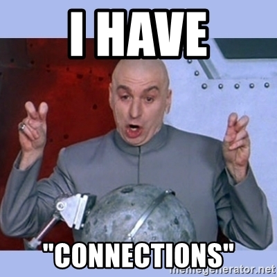

Is this just me or LinkedIn became this annoying social network where recruiters and people you never worked with keep poking you for new connections?

Like other professional social networks, LinkedIn was designed to connect people around the globe and empower them with the ability to get jobs, hire talents and be the backbone for professional communication. However, that concept has been exploited because there are people that leverage this concept for their own benefits.

I don't have a problem in making new connections, friendships, and acquaintances, but I personally can't approve a connection request from someone that I never meet in my life, nor one that I never worked with. The former seems to be even more relevant on LinkedIn which is supposed to be for professionals. In this context, I simply cannot understand the need for people to connect with someone they never meet.

Some friends think that is unpolite denying a connection requests on LinkedIn, and they naturally disagree with my way of thinking. I don't blame them. Perhaps I might be a little old fashion in this regard. But hey, we all can have our reservations right? For instance, I simply rate this concept of TL;DR that most people tend to use while they write, but I prefer not to criticise.

Nonetheless, it would be cool if LinkedIn would offer a way to create something -- such as a challenge or a task -- in which people would only be allowed to send an invitation after completing that. For Software Engineers like me that could be a simple PR filed in a project that I am working on GitHub. Rejected PRs wouldn't count, though.
