This year I had the honor of speaking at JEEConf; one of the most important Java conferences in Europe hosted in the heart of Ukraine. The conference held two days full of content related to Java and related technologies.

I was really impressed with the number of smart people that I could shake hands and meet at the conference. One of the sessions that I presented there was **Tips & Tricks about Apache Kafka in the Cloud for Java Developers**, that aimed to show some of the details that developers building Java applications for Apache Kafka should know before venturing themselves in moving their workloads to Cloud.

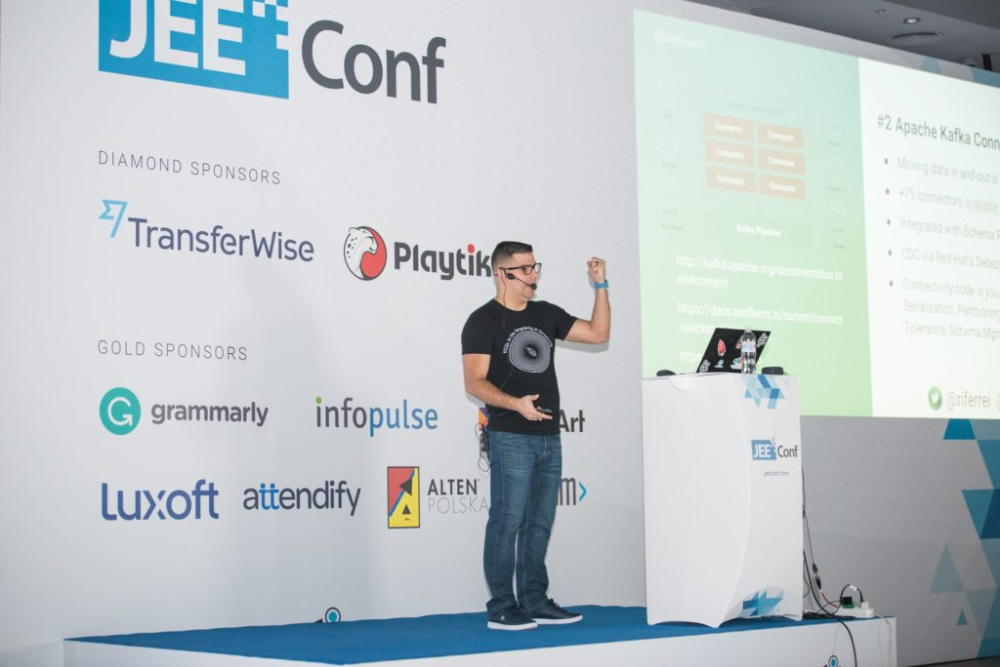

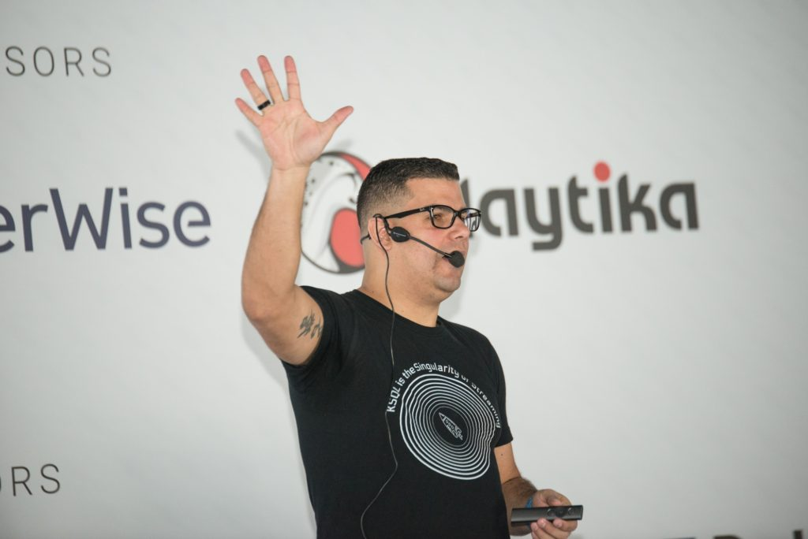 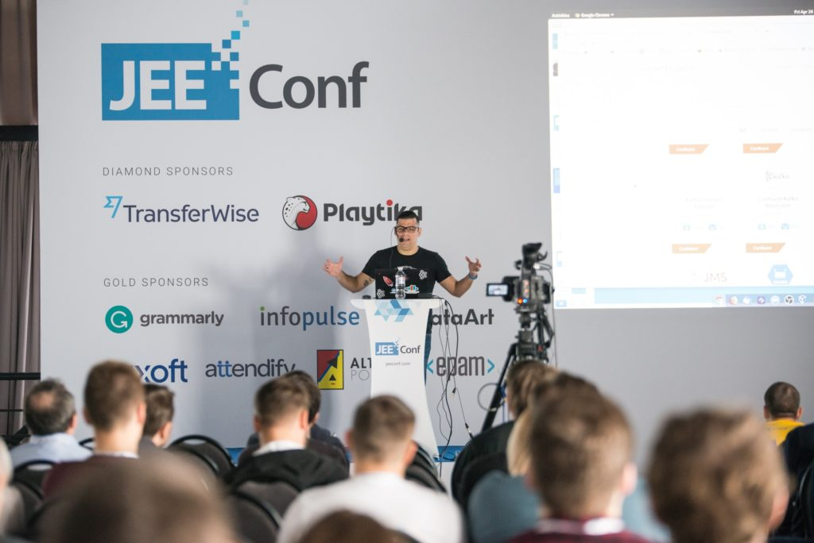 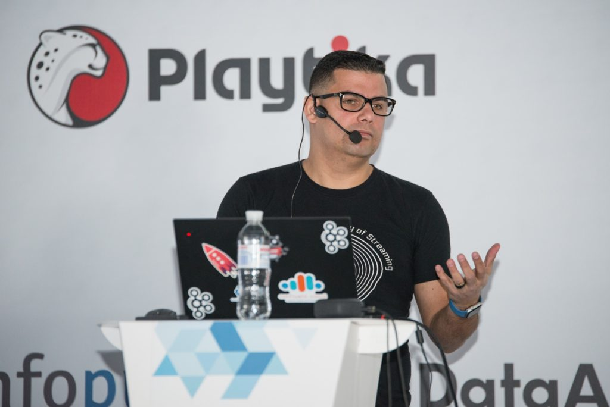

It was one of the first sessions of the morning, and I was glad to see the room packed with peopled interested in Apache Kafka. Even happier when I found out that 90% of the people there was familiar and/or already working with it.

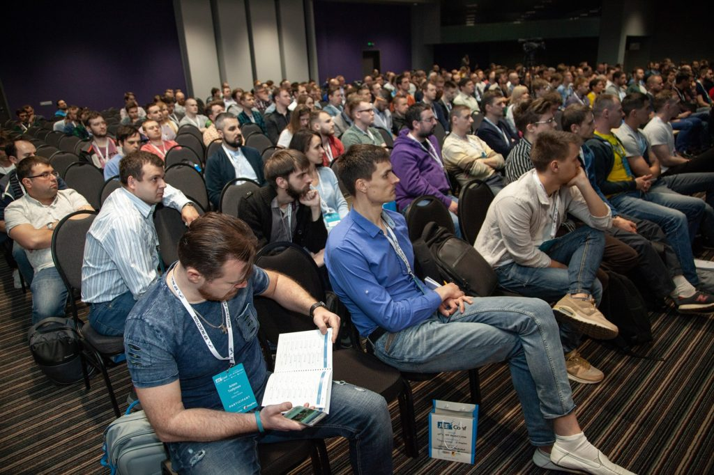 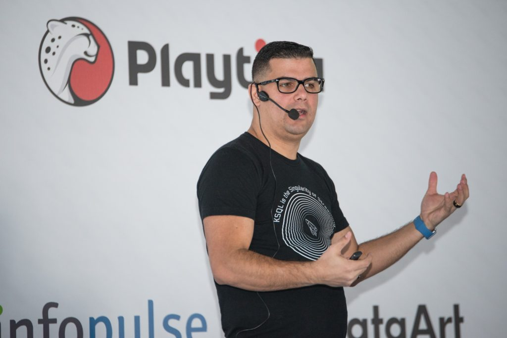

The slides from this presentation is here:

https://speakerdeck.com/riferrei/tips-and-tricks-about-apache-kafka-in-the-cloud-for-java-developers-e092c220-9869-413d-a55a-a726b6800afd

Of more importantly... the recording of the presentation is also available:

https://www.youtube.com/watch?v=I0Cst1H6edQ

Another talk that I delivered at this conference was **Implementing Distributed Tracing ‘Like a Boss’ in your Kafka Deployments** ; where I showed how to implemented tracing using the OpenTracing extensions for Kafka, as well as the extensions that I created for KSQL, Connect and REST Proxy.

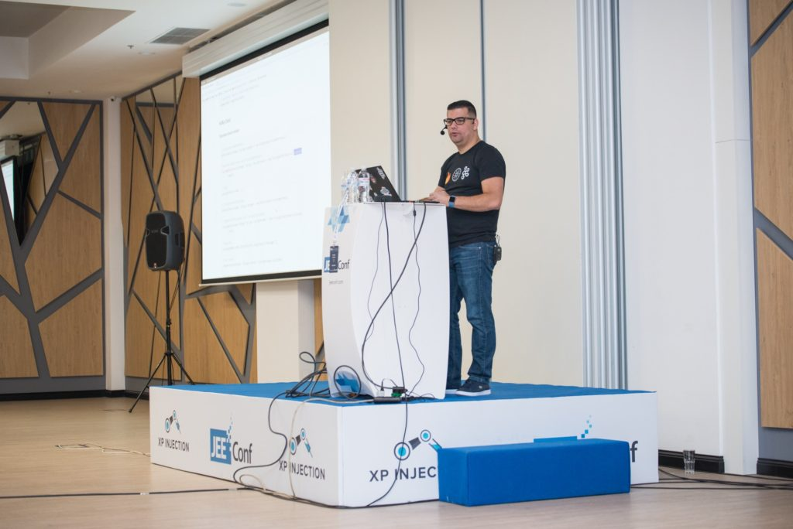 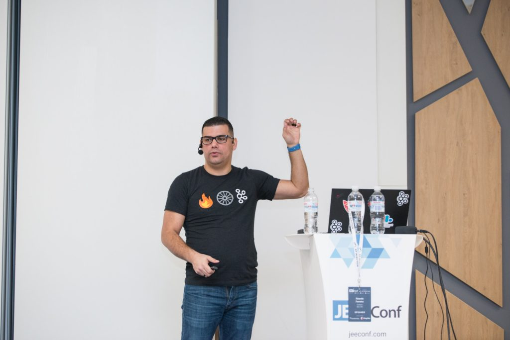 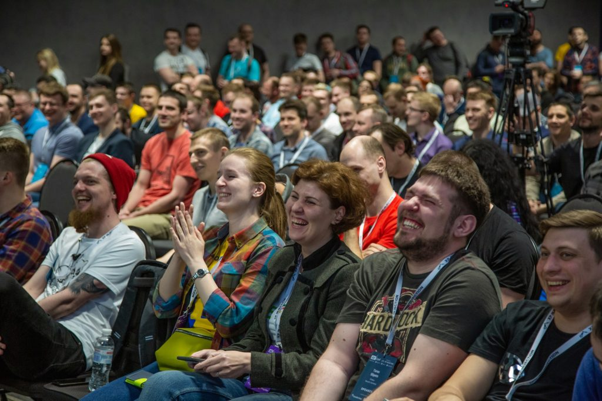 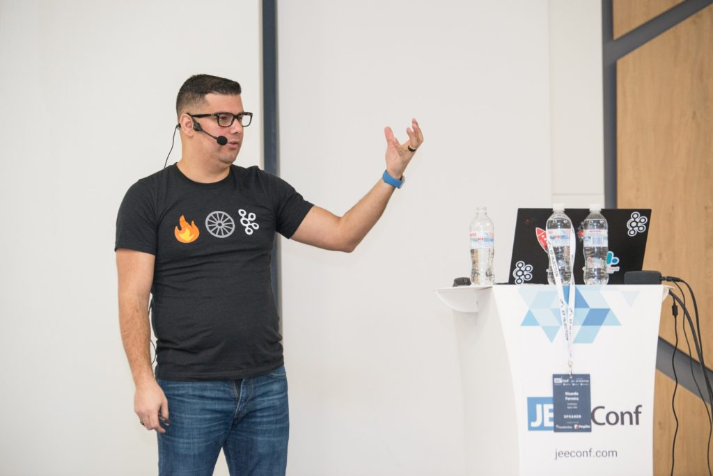 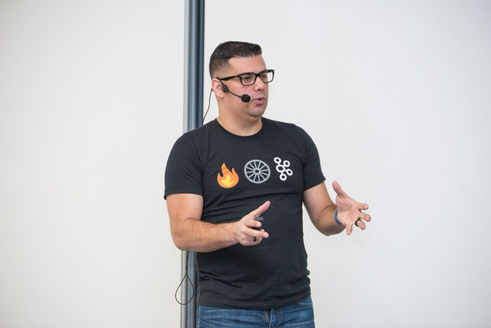 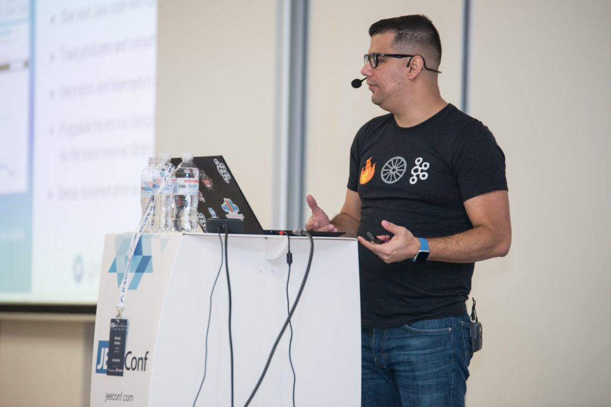

The slides from this presentation is here:

https://speakerdeck.com/riferrei/implementing-distributed-tracing-like-a-boss-in-your-apache-kafka-deployments

...as well as the recording of the presentation:

https://www.youtube.com/watch?v=9WqdqmQcaro
