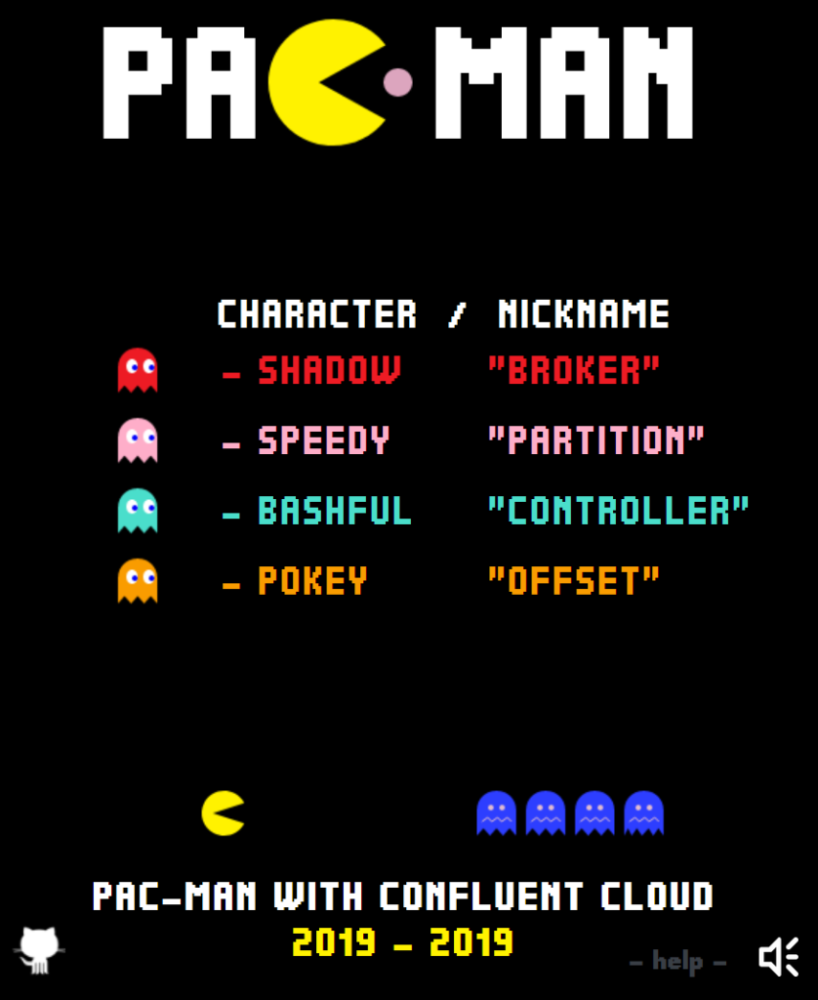
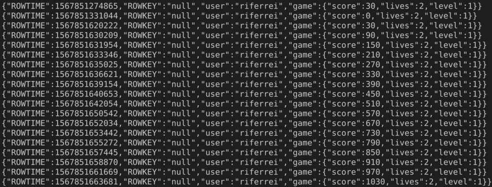
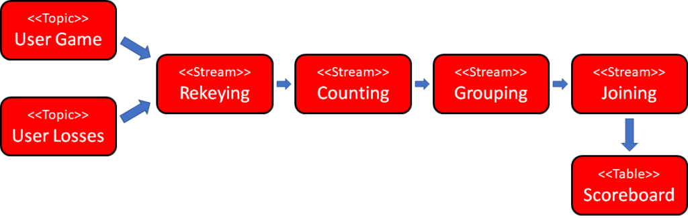
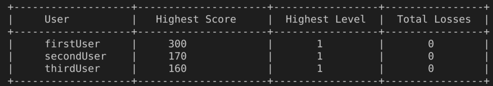
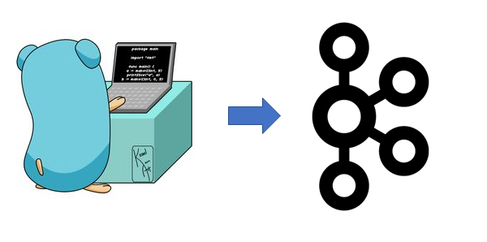

We are less than one month away from the next edition of the world's best conference about Apache Kafka known as Kafka Summit, and I would like to detail a bit what is going to be the focus of my talk **Being an Apache Kafka Developer Hero in the World of Cloud**.

https://kafka-summit.org/sessions/developer-hero-cloud/

As you can read in the description, this talk is all about [Confluent Cloud](https://www.confluent.io/confluent-cloud/), where I will be showing the first steps to start working with event streaming applications using this awesome Apache Kafka as-a-service product from Confluent. However, the interesting part here is **how** **I am going to do that**.

Since a picture is worth a thousand words, I will start explaining this one:

That is right: I will be using the infamous [Pac-Man](https://en.wikipedia.org/wiki/Pac-Man) game as a building block to teach how to develop event streaming applications using Confluent Cloud. Attendees of this talk will get to **play with the game using their phones** since the game will be deployed in a cloud provider. As they play with the game, events will be emitted to Kafka topics in near real-time.

There will be two types of events being emitted:

  * Events about the game containing current score, number of lives and levels;
  * Events about when the user loses a game, usually known as game-over;

To make things even more interesting, I will be creating a fairly complex processing **pipeline using KSQL** , that will compute aggregated statistics about each user's game. I will create this pipeline step-by-step so the attendees can get the chance to see how the pipeline evolves from simple Kafka topics to a set of streams that will suffer lots of operations such as rekeying, counting, grouping, joins -- and finally becoming a table that will hold the computed statistics from each user's game.

This table will serve the game's scoreboard... an always-updating, live, near real-time display that lists all game's statistics per user, where **users will be ordered** based on their game's performance:

This scoreboard will be implemented using [Golang](https://golang.org), which will act as a **microservice that consumes the table created**. This showcase a typical event streaming application where microservices will be acting upon the data that is being held-and-computed by Kafka, therefore showing an **end-to-end application** , far from a simple hello world.

Throughout the 45 minutes of the talk, I will be doing a **live coding session** with the attendees where I will be executing the following tasks:

  1. Creating a cluster from scratch in Confluent Cloud.
  2. Testing connectivity with a simple producer and consumer.
  3. Cloning the GitHub repo that contains the Pac-Man game.
  4. Walking through the code and explaining the architecture.
  5. Setting up the necessary credentials to deploy the game.
  6. Deploy the game in the cloud provider using Terraform.
  7. Ask attendees to play with the game to generate events.
  8. Build the scoreboard using a pipeline written in KSQL.
  9. Run the Golang consumer to verify data correctness.
  10. Destroying the development KSQL Server created.
  11. Creating a KSQL application on Confluent Cloud.
  12. Re-creating the scoreboard in the KSQL application.

...and of course, I will be answering as many questions attendees may have. To ensure I will have the time to execute all these tasks, I will be**bringing near-zero slides** for this talk. Therefore, attendees can expect to spend more time with the code part and less time with boring slides.

Looking forward to seeing all of you in shinny San Francisco, though I cannot promise if the weather will be _that_ shinny!
