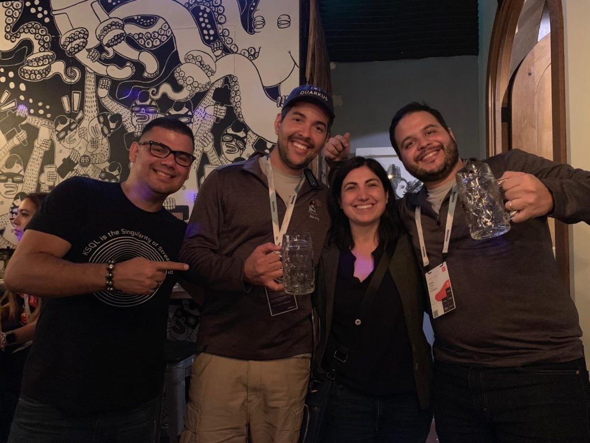
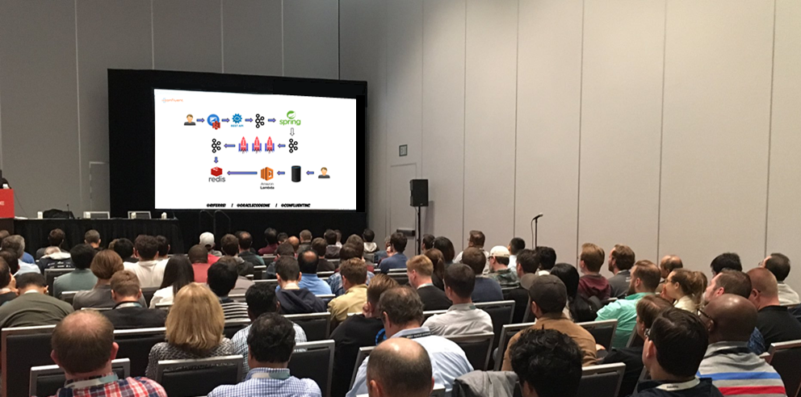

Last week I had the chance to attend one more time Oracle's new developer's conference know as [Oracle Code One](https://www.oracle.com/code-one/). It was so nice to catch up with great friends, plus being able to party with people from the Java community. They certainly know how to make things funny and entertaining.

Furthermore, I also had the chance to share a little about Apache Kafka in a talk that I delivered for a room full of developers interested in this technology.

The talk "Keep your Caches Hot with Apache Kafka and the Connector API" was very well accepted and I was glad to see that people liked. I had delivered this talk before in Kafka Summit New York and In-Memory Computing Summit in London, so I guess this time people get the chance to enjoy a more battle-proven demo. Here are the slides of the talk:

https://speakerdeck.com/riferrei/keeping-your-caches-hot-with-apache-kafka-and-the-connector-api

Looking forward to next year's edition of the conference =)
