This week I had the honor of being one more time in the most exciting conference for Apache Kafka in the world, known as Kafka Summit. Only this time was different because I could contribute a lot for this conference.

My first contribution was building and recording a demo that was shown in the second day of the conference when **Priya Shivakumar** was talking about Confluent Cloud. I have received some good feedback about that demo, which of course made me feel really proud.

BTW, Priya did a great job explaining what Confluent Cloud is and why it is the most successful managed service for Apache Kafka out there.

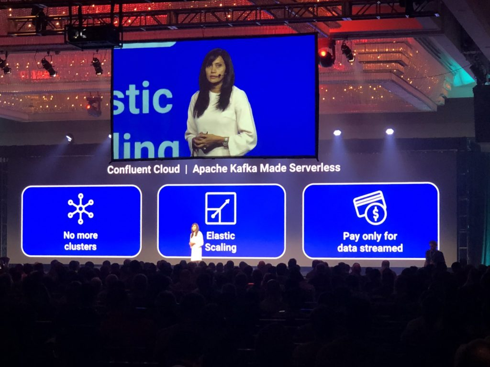

I also had the chance to host a couple tracks during the 1st and 2nd day of the conference. I hosted the Event-Driven Development track, as well as the Core Kafka track, where I get the chance to announce some really amazing speakers.

Finally, I had the chance to speak at the conference. My session was "Being an Apache Kafka Developer Hero in the World of Cloud" and I think I did a pretty good job while presenting it. My talk was all about showing how easy Confluent Cloud is and how fast it can help you develop event streaming applications. The way I decided to showcase this was by showing a demo from scratch, where I would bring nothing to the stage other than a GitHub repository link and internet connection to build this up from the ground.

Though I have had a few hiccups while cloning the repository (I still think the internet was blocking traffic somehow) I was able in less than 30 minutes create a Confluent Cloud cluster in AWS, deploy an entire application also in AWS and let the audience play with the application. The application itself was the Pac-Man game, and I am pretty sure that I nailed picking that game because everybody liked playing it.

Here is a set of pics that had been taken from my Twitter feed:

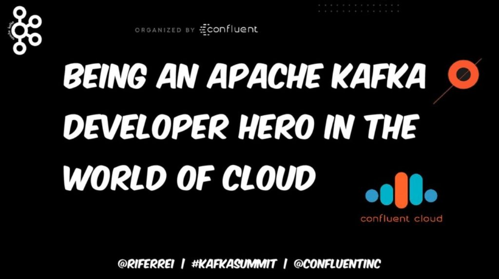 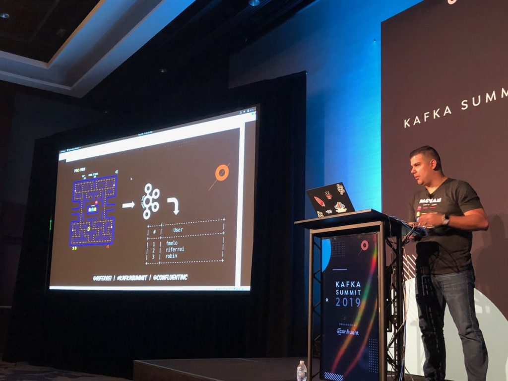 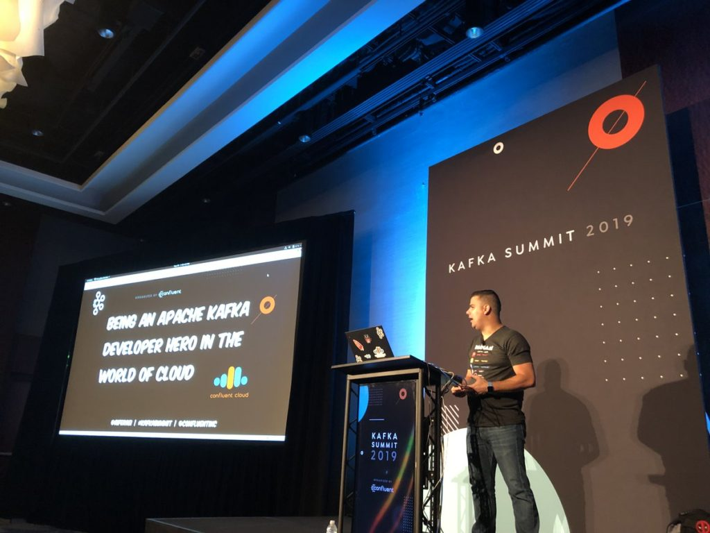

Since I have announced myself as a Deadpool fan -- the audience asked me to wear my mask for a picture. Hey, can you say no to that?

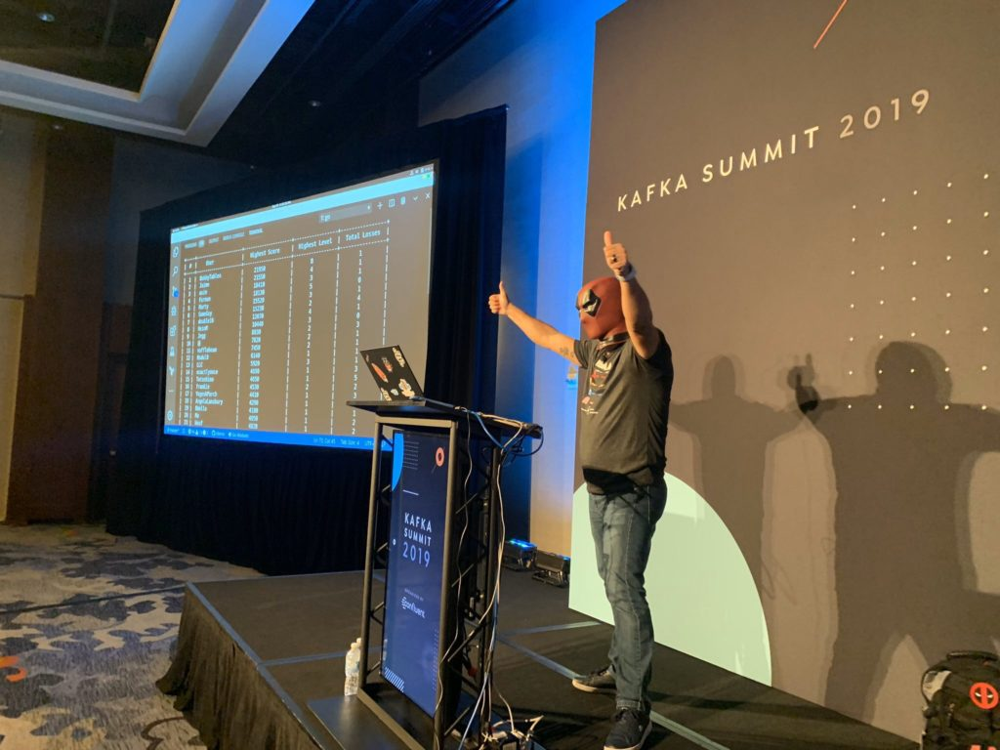

Going to Kafka Summit is good for several reasons, but the most important of all is the community. Being able to interact, exchange experiences, help and being helped, as well as engaging with others, is what makes Kafka Summit a huge success.

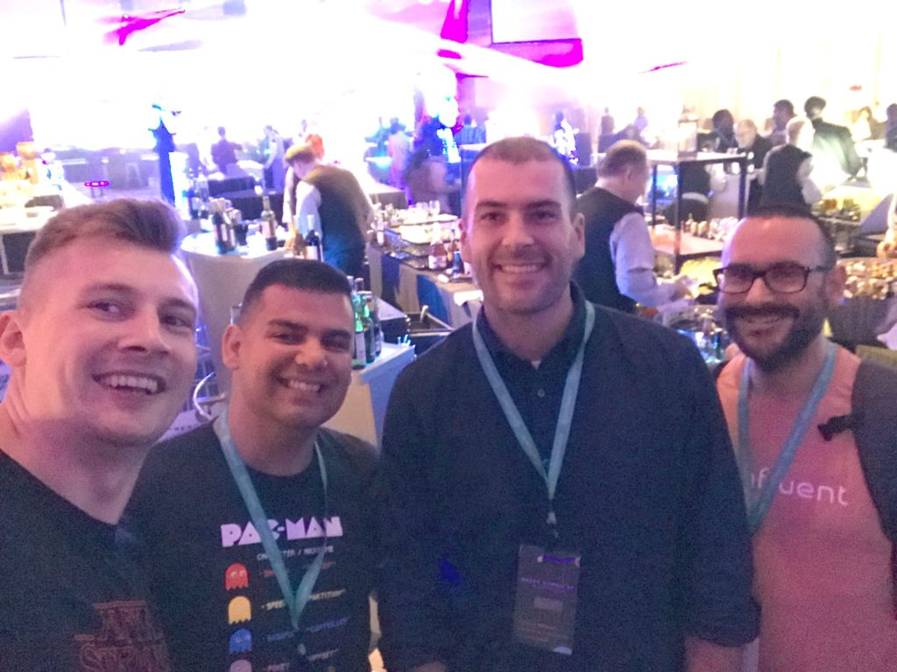 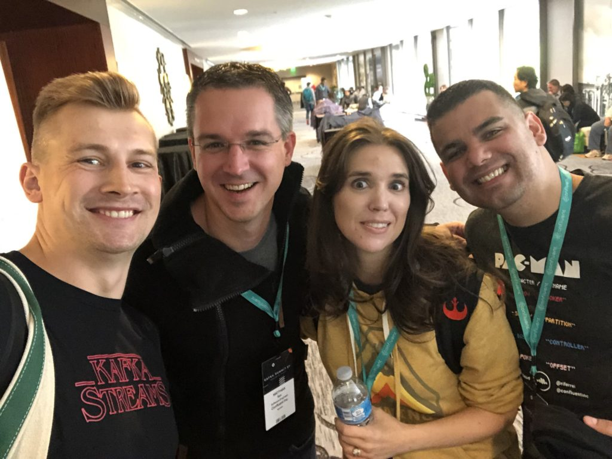 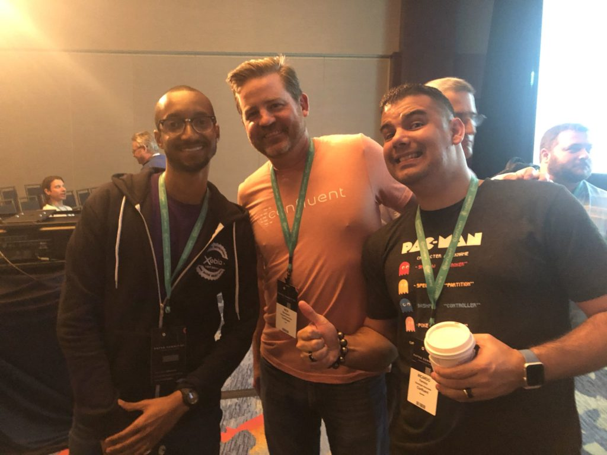 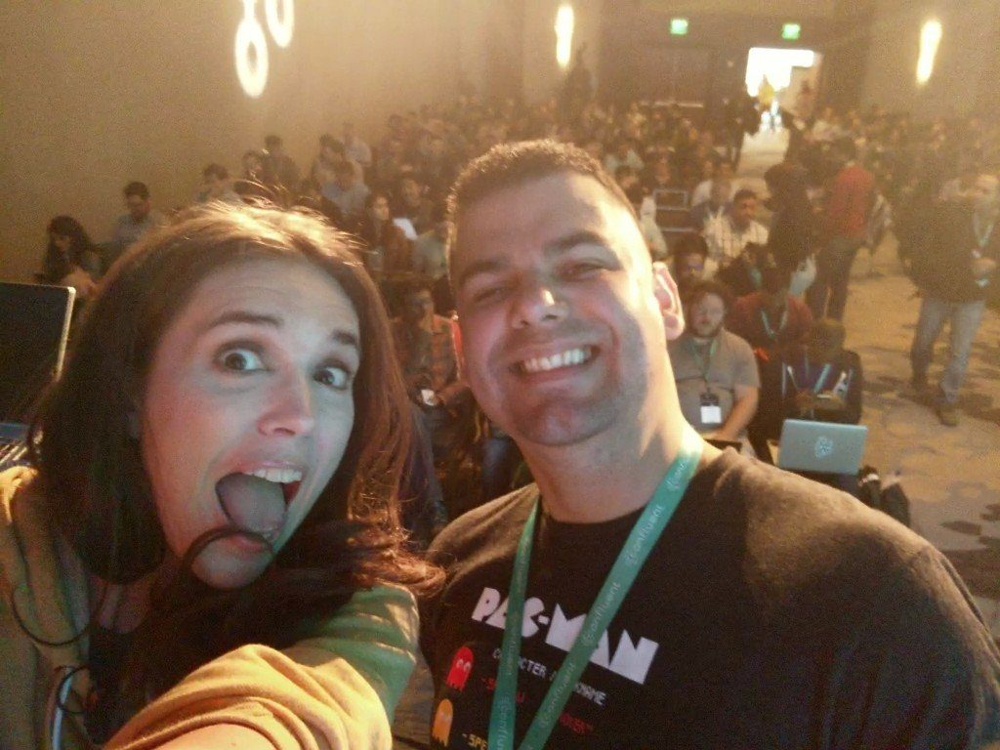 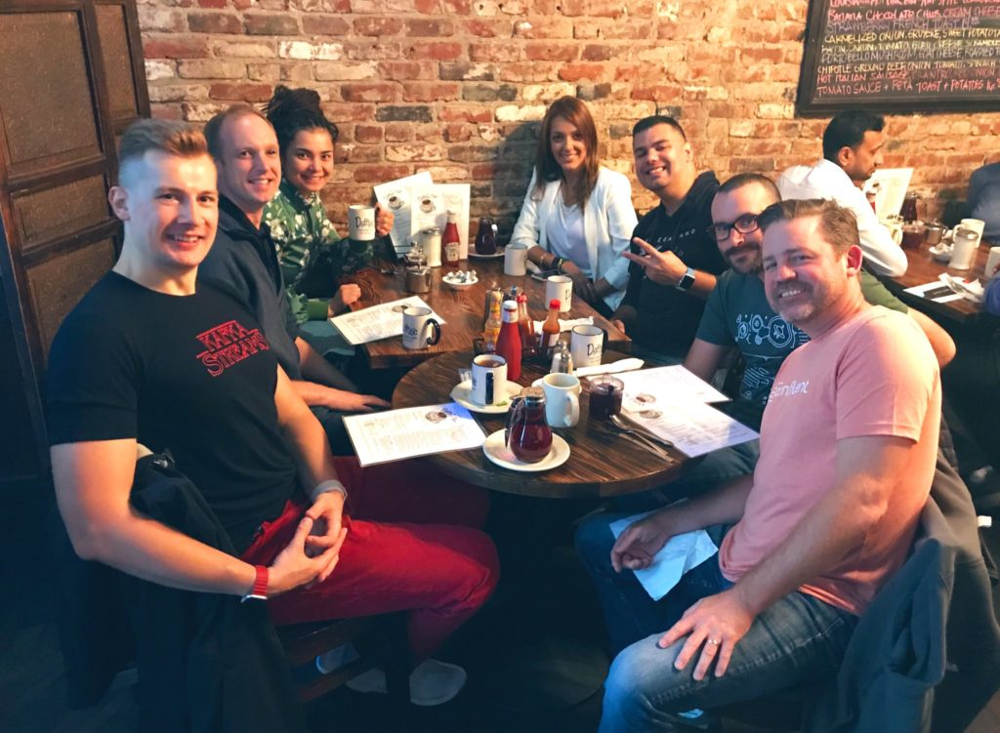 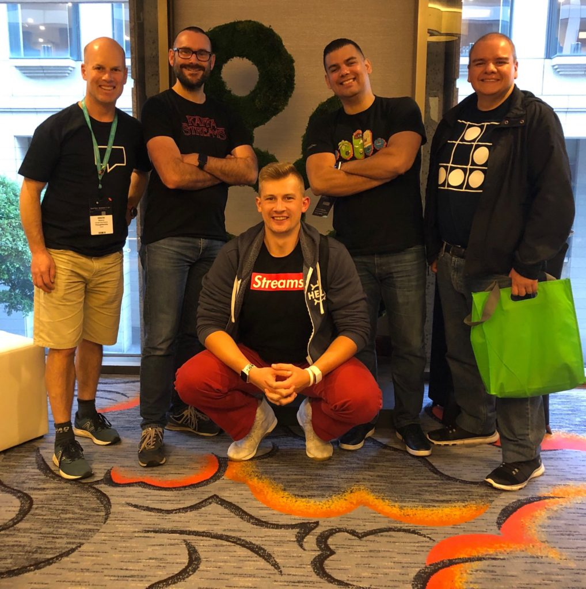 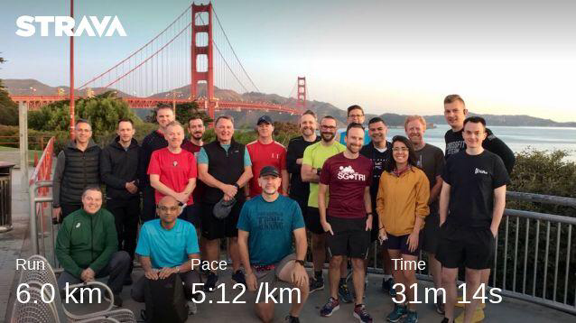 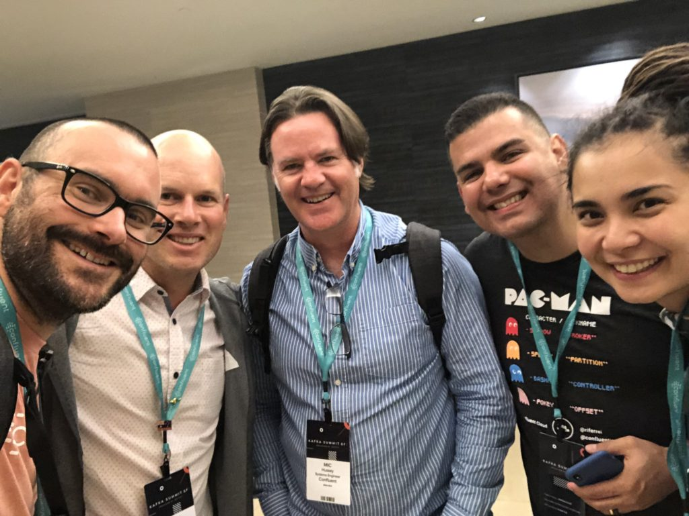

See you next year Kafkateers!
