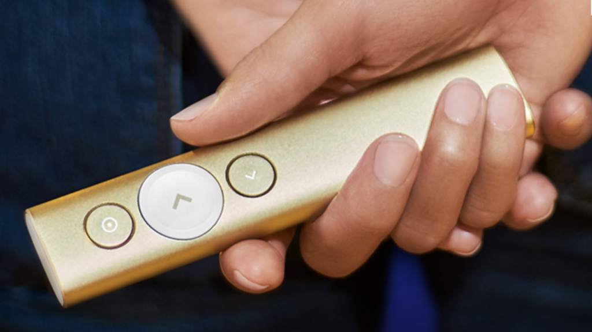
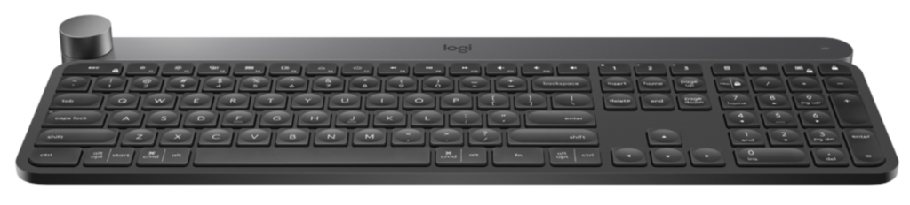
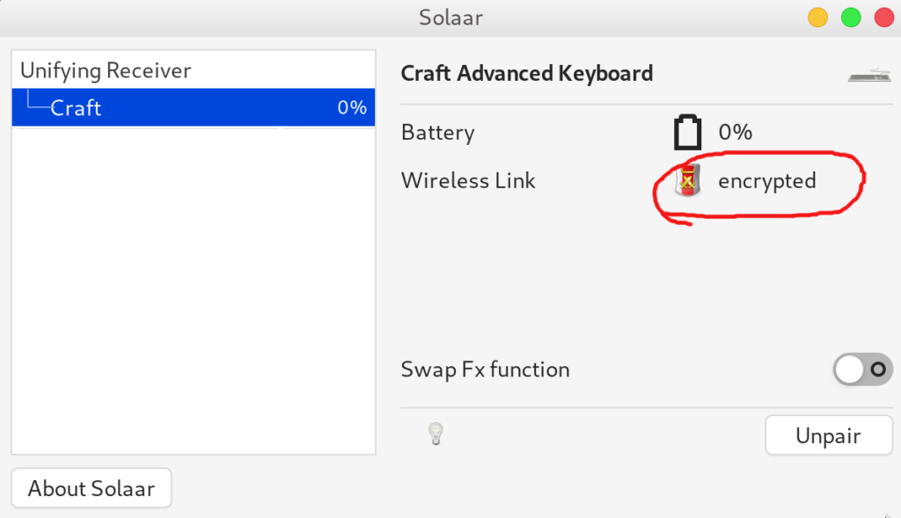

I am a huge fan of what Logitech creates for the computer industry and I have been using its products for quite some time now. However, for the last 5 years I took the [smart] decision of using Linux for desktop and by doing so -- I realized that certain products seems only to work well with Mac/Windows, leaving no space for Linux.

In this post I will provide some tips about open-source projects that helps you to get your favorite Logitech products working smoothly with Linux, Fedora in particular.

### **[Logitech Spotlight Presentation Remote](https://www.logitech.com/en-us/product/spotlight-presentation-remote)**

This is by far my favorite product from Logitech. I have been using it for the last one year with almost zero headaches about using Linux in my laptop. The trick to get it working well is using the following open-source project:

<https://github.com/jahnf/Projecteur>

This project allows you to use pretty much all presenting features from Spotlight, except for the timer. But I am confident that the project will evolve and add support for this pretty soon. Just follow the steps from the README and you will be good to go. It might be a little tricky to setup via Bluetooth, so if you want things working quickly I would recommend setting up via USB using the donkey receiver.

### **[Logitech MX Anywhere 2s](https://www.logitech.com/en-us/product/mx-anywhere-2s-flow)**

This is one of the best mouses I have ever had in my life and I like it so much that I have bought two of them: one for my office and another to keep me in the road. There is no big secret to get it working via Bluetooth since there is nothing fancy about this mouse, but if you want to leverage the multi-computer feature then you will need to leverage the unifying receiver. This open-source is your good to go:

<https://github.com/pwr-Solaar/Solaar>

I find this software very handy to perform the whole pair/unpair process, as well as to keep track of how much battery I still have on the mouse before the next recharge.

### **[Logitech Craft Wireless Keyboard](https://www.logitech.com/en-us/product/craft)**

I mean, what an incredible keyboard. It is by far one of the best keyboards I have ever had, though it is quite expensive. It doesn't look like at first but three months later using it you start to feel that your life isn't great if you don't type from it. The amount of gestures that you end up learning with the keyboard makes your life really productive, to a point where you certainly feel the difference if you type from some other one. The key to have it working with Linux is the same project from the mouse:

<https://github.com/pwr-Solaar/Solaar>

Besides using the Solaar software, I would highly recommend keeping this keyboard in a good distance from wireless routers. It is not that it doesn't work, but you may feel that sometimes the connection between the keyboard and the unifying receiver is lost -- which it is automatically restores few seconds later. Depending of how old your router is (notably one that might not leverage multiple channels) this can be very frequent and therefore, annoying.

To double-check if you are having these problems, keep an eye on the Solaar UI and check when the wireless link from your keyboard changes from 'encrypted' to 'offline':

If that happens, try to set up your router to use another channel that is not interfering with your keyboard. FWIW, this is not necessarily a Linux problem, since it might also occur with Mac/Windows =)

### **[Logitech BRIO Ultra HD Pro Webcam](https://www.logitech.com/en-us/product/brio)**

This is the latest product from Logitech that I have been using and after some tweaks everything seems to be working as expected. Though it is a standard USB 3.0 plug-and-play camera, there is a few options that you might need to change in order to leverage its full potential. Therefore, it all boils down to the fact that you need to change specific product properties that you can't by default since there is no software for Linux.

Luckily enough, Linux has a very good support for tools that allows you to do that, and the blog below shows how to do that using the **v4l2-ctl** tool:

https://www.kurokesu.com/main/2016/01/16/manual-usb-camera-settings-in-linux/

In my case particularly, I have found very useful to change the properties 'zoom_absolute', 'focus_auto', and 'led1_frequency' of my camera.
