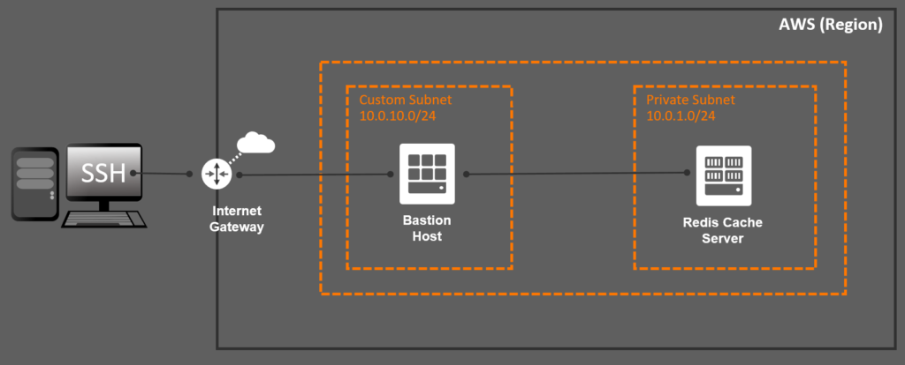

[AWS ElastiCache](https://aws.amazon.com/elasticache) is a fully managed service that allows users to easily and quickly use cache technologies like [MemCached](https://memcached.org) and [Redis](https://redis.io) without the gory implementation details. But this doesn't come for free. Developers often complain about the fact that the service is deployed in private subnets and due to that fact -- they are not entitled to easily access for troubleshooting purposes.

A pattern to solve this problem is the usage of a bastion host, that sits between your machine and the private subnet to allow troubleshooting with ease. This post will show how to deploy a AWS ElastiCache service for Redis along with a bastion host using [Terraform](https://www.terraform.io).



If you are used to implement Infrastructure-as-a-Code using Terraform then most of the code from this post won't be new to you. The real magic relies on the networking plumbing that you need to code to ensure the end-to-end communication. For starters, you need to create an internet gateway to allow inbound communication from the internet:
```
resource "aws_internet_gateway" "internet_gateway" {
  vpc_id = aws_vpc.aws_vpc.id
  tags = {
    Name = "${var.global_prefix}-internet-gateway"
  }
}

resource "aws_route" "main_route" {
  route_table_id = aws_vpc.aws_vpc.main_route_table_id
  gateway_id = aws_internet_gateway.internet_gateway.id
  destination_cidr_block = "0.0.0.0/0"
}
```

Then, you need to ensure that the subnets for both the cache server and the bastion host are deployed in the same availability zones for the selected region:
```
data "aws_availability_zones" "available" {
  state = "available"
}

resource "aws_subnet" "cache_server" {
  vpc_id = aws_vpc.aws_vpc.id
  count = length(data.aws_availability_zones.available.names)
  cidr_block = element(var.private_cidr_blocks, count.index)
  map_public_ip_on_launch = false
  availability_zone = data.aws_availability_zones.available.names[count.index]
  tags = {
    Name = "${var.global_prefix}-cache-server-${count.index}"
  }
}

resource "aws_subnet" "bastion_host" {
  vpc_id = aws_vpc.aws_vpc.id
  cidr_block = "10.0.10.0/24"
  map_public_ip_on_launch = true
  availability_zone = data.aws_availability_zones.available.names[0]
  tags = {
    Name = "${var.global_prefix}-bastion-host"
  }
}
```

There has to have firewall rules that will allow SSH inbound access to the bastion host, as well as TCP inbound access from the bastion host to the cache server. Therefore you need to setup some security groups:
```
resource "aws_security_group" "cache_server" {
  name = "${var.global_prefix}-cache-server"
  description = "AWS ElastiCache for Redis"
  vpc_id = aws_vpc.aws_vpc.id
  ingress {
    from_port = 6379
    to_port = 6379
    protocol = "tcp"
    security_groups = [aws_security_group.bastion_host.id]
  }
  ingress {
    from_port = 6379
    to_port = 6379
    protocol = "tcp"
    cidr_blocks = var.private_cidr_blocks
  }
  egress {
    from_port = 0
    to_port = 0
    protocol = "-1"
    cidr_blocks = ["0.0.0.0/0"]
  }
  tags = {
    Name = "${var.global_prefix}-cache-server"
  }
}

resource "aws_security_group" "bastion_host" {
  name = "${var.global_prefix}-bastion-host"
  description = "Cache Server Bastion Host"
  vpc_id = aws_vpc.aws_vpc.id
  ingress {
    from_port = 22
    to_port = 22
    protocol = "tcp"
    cidr_blocks = ["0.0.0.0/0"]
  }
  egress {
    from_port   = 0
    to_port     = 0
    protocol    = "-1"
    cidr_blocks = ["0.0.0.0/0"]
  }
  tags = {
    Name = "${var.global_prefix}-bastion-host"
  }
}
```

In order to access the bastion host from your machine, you will need to use the same private key that was used to provision the bastion host. Create a private key using the following constructs:
```
resource "tls_private_key" "private_key" {
  algorithm = "RSA"
  rsa_bits  = 4096
}

resource "aws_key_pair" "private_key" {
  key_name = var.global_prefix
  public_key = tls_private_key.private_key.public_key_openssh
}

resource "local_file" "private_key" {
  content  = tls_private_key.private_key.private_key_pem
  filename = "cert.pem"
}

resource "null_resource" "private_key_permissions" {
  depends_on = [local_file.private_key]
  provisioner "local-exec" {
    command = "chmod 600 cert.pem"
    interpreter = ["bash", "-c"]
    on_failure  = continue
  }
}
```

...finally, make sure the bastion host is created with the private key associated:
```
resource "aws_instance" "bastion_host" {
  depends_on = [aws_elasticache_replication_group.cache_server]
  ami = data.aws_ami.amazon_linux_2.id
  instance_type = "t2.micro"
  key_name = aws_key_pair.private_key.key_name
  subnet_id = aws_subnet.bastion_host.id
  vpc_security_group_ids = [aws_security_group.bastion_host.id]
  user_data = data.template_file.bastion_host.rendered
  root_block_device {
    volume_type = "gp2"
    volume_size = 100
  }
  tags = {
    Name = "${var.global_prefix}-bastion-host"
  }
}
```

I have created an end-to-end example on GitHub that shows how this is done:

<https://github.com/riferrei/aws-elasticache-with-bastion-host>

Happy troubleshooting!
