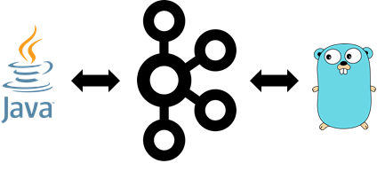

One of the most incredible things in Apache Kafka is that record values are shapeless, meaning that developers can write any set of bytes they want, and it works just fine. This can be pretty powerful if they share data among different programming languages.

However, this characteristic is sometimes inadequate. It creates coupling problems as producers and consumers need to negotiate a common format that they can rely on to write and read data. Therefore, it is essential to use a neutral format -- likely something accepted within the industry, such as Avro, Protobuf, and JSON Schemas. This post will focus on the problems raised by using Protobuf to share data between Java and Go.

Though one could argue that this is exactly what technologies like Protobuf mean to address, the reality is that in the context of Kafka, they solve only part of the problem. There is still a need to develop a format that bytes are arranged in the record. Recently I had to build a prototype of an application written in Java and Go to share data using Protobuf. I started by creating a producer and consumer in Go to share data, and it worked fine. Then, I wrote a consumer in Java to read the data produced by Go, and to my surprise, I got a heck of a deserialization exception.

This happened because the deserializer that I used in my Java code tried to read the bytes in a specific sequence, which I haven't used in my Go producer. After a couple of hours investigating the deserializer code (The KafkaProtobufDeserializer from Confluent), I figured out which format was expected and refactored the Go code accordingly.

In a nutshell, if you need to deserialize Protobuf-based records using Confluent's deserializer, then your producers need to arrange the bytes in the following sequence:

[Magic Byte] + [Schema ID] + [Message Index Data] + [Message Payload]

[Message Index Data] is an array containing the indexes corresponding to the message type serialized. The first element of this array is always an item representing the size of the array. So as you can see, there is a lot of internal logic in how the bytes are arranged for Confluent's deserializer to work. I have written two examples (one in Java and another in Go) that show producers and consumers sharing data using Kafka and Protobuf successfully.

Example in **Go** : <https://github.com/confluentinc/demo-scene/tree/master/getting-started-with-ccloud-golang>

Example in **Java** : <https://github.com/confluentinc/demo-scene/tree/master/getting-started-with-ccloud-java>

If you ever struggle in executing code that tries to serialize and deserialize data using Kafka and Protobuf, always check how the bytes are being arranged by one of the serializers. The format might be neutral, but the order of the bytes in the record's value is not.
