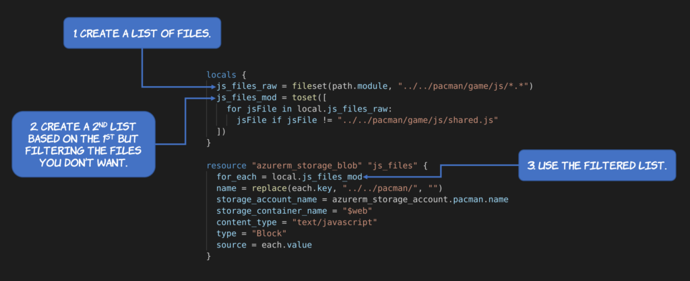

Since the introduction of the `for_each` feature in Terraform 0.12 it is now possible to code powerful constructs to express the logic of your infrastructure. But sometimes you have to use some creativity to use this feature. I recently had to write a Terraform code that could upload all the JavaScript files from a local folder into a storage blob in Azure. But one of these files would have some template expressions so I wanted to upload all the files from the local folder except that one — because I would upload it individually.

After some time digging I ended up with a very elegant solution. First I created a variable to hold the original list of files. For this I used the [fileset](https://www.terraform.io/docs/configuration/functions/fileset.html) function.
```
js_files_raw = fileset(path.module, "../../pacman/game/js/*.*")
```

Then I created a secondary variable to represent all the files from the previous list except the one(s) that I would like to exclude. To exclude the unwanted files I created a for loop block to iterate over all the items of the list and negate the ones that I don't want.
```
  js_files_mod = toset([
    for jsFile in local.js_files_raw:
      jsFile if jsFile != "../../pacman/game/js/shared.js"
  ])
```

Note the usage of the [toset](https://www.terraform.io/docs/configuration/functions/toset.html) function to explicitly create a set of strings out of the array. Finally I could simply reference the mutated variable from the resource that would upload the files to the storage blog.
```
resource "azurerm_storage_blob" "js_files" {
  for_each = local.js_files_mod
  name = replace(each.key, "../../pacman/", "")
  storage_account_name = azurerm_storage_account.pacman.name
  storage_container_name = "$web"
  content_type = "text/javascript"
  type = "Block"
  source = each.value
}
```

Here is a summary of all the steps:



I hope that help if you find yourself in the same situation that I did 🙂
