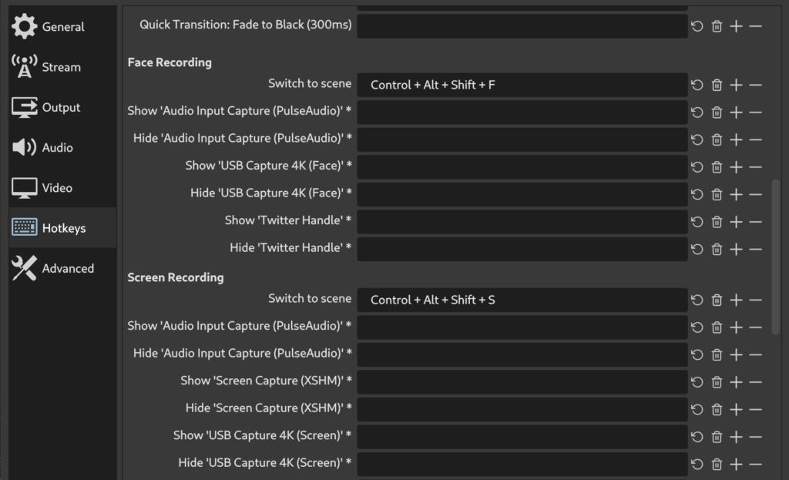

I have lost count of how many times I had to apply workarounds in my Fedora laptop to use certain devices. For all of you that had to go down the same path, you know the feeling of hopelessness. The reason why I never get tired of helping people with the challenges I have. This post will describe my journey to get the [Elgato Stream Deck](https://www.elgato.com/en/gaming/stream-deck) device working like a charm on my laptop.


If you are reading this blog post, then probably you did exactly what I did, which was buying the device with the slight assumption that everything will work given that you did your "homework" and searched for posts like [this](https://opensource.com/article/20/12/stream-deck), [this](https://www.gamingonlinux.com/articles/using-the-elgato-stream-deck-on-linux-just-got-a-whole-lot-easier-with-streamdeck-ui.15180), and [this](https://pypi.org/project/streamdeck-ui/) one on the internet.

Well, you are not wrong. There is a way to make it work on Fedora. It is just not as simple as the instructions shown in most of these blog posts. So if you are in the phase of still thinking about whether you should buy or not because you are a Linux user — go ahead and buy it because it works. Just mind setting the right expectation when the device arrives: it will take you some time to get it working. But let me stop with the ranting and start being useful. Let's go with the steps.

## 1\. Which project to use?

Though there are many ways to get Stream Deck working on Linux, I think the best approach is to use the project streamdeck-ui. But before telling you why to let me give you this heads up: if you are in the process of installing dependencies of other projects, please stop right now and undo whatever you have done already. These other dependencies will get you in trouble if you finally come to sense and use the streamdeck-ui project. It took me half a day to figure out that the project wasn't working because I messed up some OpenSSL libs that the project required and some other projects installed but with different versions.

The streamdeck-ui project is my choice because it is excellent and stable. Secondly, the project maintainers are really friendly and willing to help with each use case's specifics, which in the Linux world is something worth mentioning. Thirdly it is based on Python, making things a bit easier in terms of troubleshooting and dependency mgmt. Finally, it is virtually what all my other friends are using, so there is a pattern in place already.

## 2\. Fixing your Python story

The project is written in Python and depends on another library called Elgato Stream Deck Library that is also written in Python. Because of this, you need to get your Python story sorted out in your machine, especially if you (like me) have lots of tools installed that depend on the thousands of distributions/versions/lineages of Python. Make sure to have a Python 3.7 interpreter in your path, preferably with the right dependencies in place. There are many ways to get this done, but the simpler you can get is installing [Homebrew for Linux](https://docs.brew.sh/Homebrew-on-Linux) in your machine — which creates an isolated environment for your specific workloads.

Creating an isolated installation of Python to run the streamdeck-ui project will protect you from situations like mine. I have the OpenSSL version openssl-1:1.1.1i-1 installed on my machine, but the project requires a different version. It took me another half a day to sort this out. 🤕

## 3\. Installing the Dependencies

Technically speaking the main dependencies that you need to take care of are these ones:
```
sudo dnf install python3-devel libusb-devel python3-pip libusbx-devel libudev-devel
```

The project documentation will ask you to add the user to the group plugdev, but you don't need it. Fedora users know that this group no longer exists anyway.

## 4\. Handling Udev Rules

Yes, you need to create some udev rules in your machine for the software to see the device over the USB port. The instructions provided by the project are outdated, though. Here is what you actually need to do. Create a file `**/etc/udev/rules.d/99-streamdeck.rules**` with the following content:
```
SUBSYSTEM=="usb", ATTRS{idVendor}=="0fd9", ATTRS{idProduct}=="0060", TAG+="uaccess"
SUBSYSTEM=="usb", ATTRS{idVendor}=="0fd9", ATTRS{idProduct}=="0063", TAG+="uaccess"
SUBSYSTEM=="usb", ATTRS{idVendor}=="0fd9", ATTRS{idProduct}=="006c", TAG+="uaccess"
SUBSYSTEM=="usb", ATTRS{idVendor}=="0fd9", ATTRS{idProduct}=="006d", TAG+="uaccess"
```

Save it and, as expected, reload the rules by executing `sudo udevadm control --reload-rules`. After this, make sure to follow the instructions of unplugging and plug the device back in. It is indispensable.

## 5\. Switching scenes in OBS

It shouldn't strike you as a surprise that the streamdeck-ui project doesn't have the same integration level with Linux as the official software from Elgato does with Windows and macOS. Because of this, certain actions won't be as magical as shown in the nice trailers you may have seen, showing users easily picking existing scenes from OBS and associating with keys. This is going to be particularly hurtful if, like me — you are using Stream Deck to stream content from OBS, and switching between scenes is a must.

But don't worry, there is a trick that I discovered you could use. First of all, make sure to install the following dependency:
```
sudo dnf install wmctrl
```

This command allows you to control the user interface of any window running on your machine. The basic idea here is that before you run the combination of keys on OBS that will force it to switch between scenes, you first need to obtain the OBS window's focus. To do this, you need to run this command and the keys combination. For example, my OBS has the scenes called "Face Recording" and "Screen Recording" that I configured to be activated with the following keys:



On streamdeck-ui I configured one of the keys to have the following in the `**Command**` field:
```
wmctrl -xa obs
```

...and then I have the following on the `**Press Keys**` field:
```
Ctrl + Alt + Shift + F
```

This will activate the scene "Face Recording" 😉
