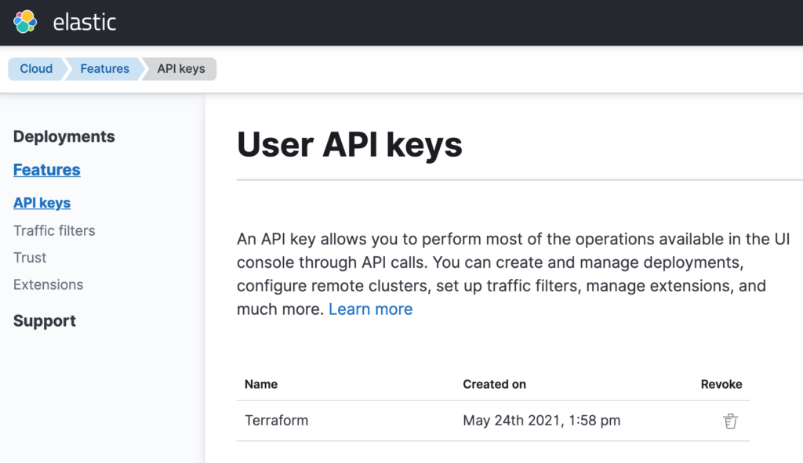
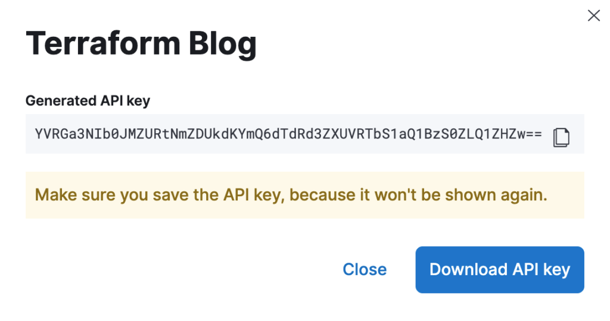
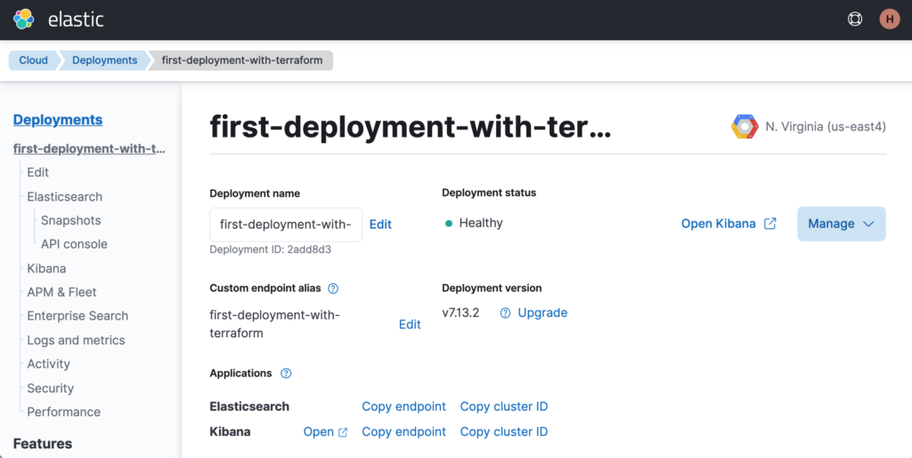
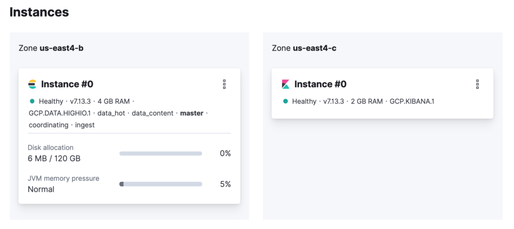
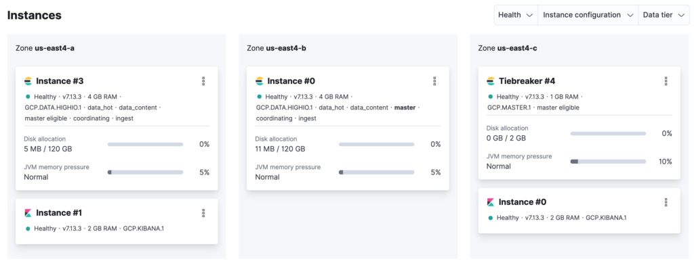
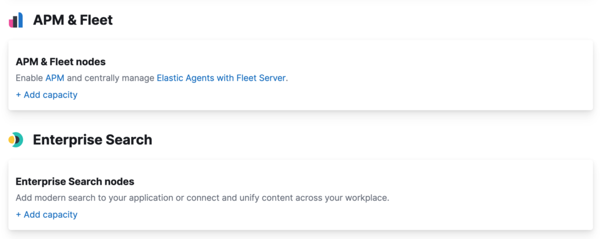

Most developers deploy their Elastic ([Elasticsearch](https://www.elastic.co/elasticsearch/) and [Kibana](https://www.elastic.co/kibana/)) clusters manually by copying the bits to the target system or semi-manually using containers. This might work well if you need to maintain few clusters for your company, where likely you know the name of each one from the top of your head. However, this approach doesn't scale very well if you have to spin up clusters on-demand for seasonal requirements.


Elastic solves this problem by providing Elastic Cloud — a family of products that allows you to treat Elastic clusters as cloud resources and manage them as if they were one. There are three options:

  * **[ESS (Elasticsearch Service)](https://www.elastic.co/cloud/)** : Allows you to create Elastic clusters in known cloud vendors such as AWS, Azure, and Google Cloud. Everything is fully automated, the infra behind the clusters is owned by Elastic, and you consume the Elastic clusters as-a-service. This is the easiest way to get started with Elastic Cloud.

  * **[ECE (Elastic Cloud Enterprise)](https://www.elastic.co/guide/en/cloud-enterprise/current/Elastic-Cloud-Enterprise-overview.html)** : Allows you to create Elastic clusters in public or private clouds, virtual machines, or somewhere in your data center. Everything is also fully automated. The difference here is that the infra is owned and managed by you, while the experience continues to be the same where you consume the Elastic clusters as-a-service.

  * [**ESSP (Elasticsearch Service Private)**](https://www.elastic.co/guide/en/cloud/current/ec-getting-started-private.html): Hosted offering where Elastic creates a private cloud (VPC) and manages it for you, including the hosts. Ideal for scenarios where security is paramount and your clusters can't be fully exposed on the internet or — if you build a hybrid architecture with parts being executed on-premises and others on the cloud. You consume the Elastic clusters as-a-service.

To allow developers to create Elastic clusters with any of these options effortlessly, there is a [Terraform provider](https://registry.terraform.io/providers/elastic/ec/latest) available that you can use to help you with your infrastructure-as-code projects. This post will explain how to get started with this provider and discuss some neat options available. Though this blog will explain how to use the provider with ESS — the user experience with ECE and ESSP is the same.

### Off to a good start: your first hello world

There aren't many things in the world of technology that can't be properly explained with a hello world. Using the Terraform provider for Elastic is no different. For this reason, let's kick things off with a first example that creates an Elasticsearch and Kibana instance on ESS.

The first step is getting yourself an API key from [Elastic Cloud](https://www.elastic.co/cloud/). This is how you will tell Terraform how to authenticate into the service to start managing resources. Log in to your Elastic Cloud account and navigate to the left menu that contains the option Features. Then, select the sub-option API keys.



> ➡️ If you don't have an Elastic Cloud account, you can create one [here](https://cloud.elastic.co/registration?elektra=en-cloud-page). It requires no credit card and you will have an account in a matter of minutes.

Generate a new API key and make sure to take note of its value. By the time you close the window that shows the generated value for the API key, you won't have the chance to retrieve it anymore. Also, make sure to keep this API key secure. Whoever gets it will be able to spin up Elastic clusters on your behalf and incur unwanted costs.



With the API key in hand, you can start writing your hello world. Listing 1 below shows how to create a deployment containing 1 Elasticsearch instance and 1 Kibana instance — both with version 7.13.2 of Elastic. They will be created on Google Cloud, in the us-east4 region.
```
terraform {
  required_version = ">= 0.12.29"
  required_providers {
    ec = {
      source = "elastic/ec"
      version = "0.2.1"
    }
  }
}

provider "ec" {
  apikey = "<YOUR_API_KEY>"
}

resource "ec_deployment" "elasticsearch" {
  name = "first-deployment-with-terraform"
  deployment_template_id = "gcp-io-optimized"
  region = "gcp-us-east4"
  version = "7.13.2"
  elasticsearch {
    topology {
      id = "hot_content"
      size = "4g"
    }
  }
  kibana {
    topology {
      size = "2g"
    }
  }
}

output "elasticsearch_endpoint" {
  value = ec_deployment.elasticsearch.elasticsearch[0].https_endpoint
}

output "kibana_endpoint" {
  value = ec_deployment.elasticsearch.kibana[0].https_endpoint
}

output "elasticsearch_username" {
  value = ec_deployment.elasticsearch.elasticsearch_username
}

output "elasticsearch_password" {
  value = ec_deployment.elasticsearch.elasticsearch_password
  sensitive = true
}
```

**Listing 1** : Creating an Elasticsearch and Kibana instance via Terraform.

To execute this code, follow these three steps:

  1. Initialize the plugins by running ➡️ `terraform init`
  2. Check the execution plan by running ➡️ `terraform plan`
  3. Efectively execute the plan by running ➡️ `terraform apply`

Once Terraform finishes, you should be able to see in the console the values from all configured outputs:
```
Outputs:

elasticsearch_endpoint = "https://0000000000000000000000000.us-east4.gcp.elastic-cloud.com:9243"
kibana_endpoint = "https://0000000000000000000000000.us-east4.gcp.elastic-cloud.com:9243"
elasticsearch_username = "elastic"
elasticsearch_password = <sensitive>
```

**Listing 2** : The outputs from the hello world code.

If you go to the Elastic Cloud portal, you should see the new deployment named **first-deployment-with-terraform**.



Now let's understand what the hell just happened ©


The code defines a resource named elasticsearch on line 15, whose type is ec_deployment. This is our main resource, and it is used to create both the Elasticsearch and Kibana instances. Each instance is defined using dedicated properties, as you can see on lines 20 and 26. Within each property, there is a sub-property called topology where it was set that Elasticsearch will have 4GB of RAM and Kibana will have 2GB of RAM. Elasticsearch was also configured as a data-tier node on line 22 by having the value `hot_content` set to the property id. Other possible values are `warm`, `cold`, `frozen`, `coordinating`, `ml`, and `master`.

How does the provider know which cloud vendor to use? You may have noticed that in line 18, we configure the property region to `gcp-us-east4`. The provider parses this value and extracts the prefix to know which cloud vendor to use. The remaining value is treated as the actual region to use. Also, on line 17, we configured the property deployment_template_id to the value `gcp-io-optimized`. This instructs the provider about which hardware profile to use while creating the Elasticsearch and Kibana nodes. This is important because, depending on your workload, you may need to beef up their computing power. Use [this link](https://www.elastic.co/guide/en/cloud/current/ec-regions-templates-instances.html) to understand what hardware profiles are available for each cloud vendor and region.


Let's now discuss some nice features that are available in the provider. If you are obsessed with security like me, you will probably feel bad about hardcoding the Elastic Cloud API key, which in turn may end up being stored in your version control system somewhere — which is a heck of a security risk. To avoid this situation, you should remove the API key from the code and provide it as an environment variable called **EC_API_KEY** right before executing Terraform.
```
provider "ec" {
}
```
```
export EC_API_KEY=<YOUR_API_KEY>
terraform apply -auto-approve
```

**Listing 3** : Removing the API key from the code and providing it as an environment variable.

We have configured that we want both Elasticsearch and Kibana under version 7.13.2. The property version allows you to have full control about which version your Elasticsearch and Kibana nodes will use. However, most of the time, you will be just willing to spin up the very last release of Elastic, and therefore — you wouldn't want to hardcode this in the code. Nor keep changing the code every time a new release comes in, right?

To overcome this problem, you can use the ec_stack datasource from the provider. This datasource allows you to look up automatically specific releases available and use them in your code. Listing 4 below shows the updated version of the code.
```
data "ec_stack" "latest" {
  version_regex = "latest"
  region = "gcp-us-east4"
}

resource "ec_deployment" "elasticsearch" {
  name = "first-deployment-with-terraform"
  deployment_template_id = "gcp-io-optimized"
  region = data.ec_stack.latest.region
  version = data.ec_stack.latest.version
  elasticsearch {
    topology {
      id = "hot_content"
      size = "4g"
    }
  }
  kibana {
    topology {
      size = "2g"
    }
  }
}
```

**Listing 4** : Using the ec_stack datasource to lookup the last release of Elastic.

Note how we configured a datasource named latest which will look up the latest release from Elastic. We have leveraged the property version_regex to look up the last release intentionally, but we could have used an expression that says, for example, that we want a release starting with 7.10. Also, note that we had to move the configuration of the region to the datasource. Consequently, the region itself was provided to the deployment as the value of the datasource.

If you run `terraform plan` again, you will see the following output:
```
Terraform will perform the following actions:

  # ec_deployment.elasticsearch will be updated in-place
  ~ resource "ec_deployment" "elasticsearch" {
        id                     = "2add8d3df647c8249c0cdb37dda4c377"
        name                   = "first-deployment-with-terraform"
        tags                   = {}
      ~ version                = "7.13.2" -> "7.13.3"
    }

Plan: 0 to add, 1 to change, 0 to destroy.
```

**Listing 5** : Terraform detecting a potential cluster upgrade.

By the time this post was being written, the latest release available was 7.13.3; Terraform could look up that information and correctly apply it to the current state to recommend the change. Running this version of the code upgrades your deployment to version 7.13.3.

Another interesting feature of the provider is customizing your Elasticsearch and Kibana clusters regarding availability and scaling. If you want to change the availability of your clusters to spread the nodes into multiple availability zones, you can use the property zone_count. To better understand this, take a look at the current topology of your Elasticsearch cluster.



As you can see, there is 1 node for Elasticsearch and 1 for Kibana, and both of them are running in only one availability zone — Elasticsearch in the `us-east4-b` zone and Kibana in the `us-east4-c` zone. This topology works but introduces the risk of data loss. Let's change this. Change the code to use the zone_count property and set its value to two for Elasticsearch and Kibana.
```
resource "ec_deployment" "elasticsearch" {
  name = "first-deployment-with-terraform"
  deployment_template_id = "gcp-io-optimized"
  region = data.ec_stack.latest.region
  version = data.ec_stack.latest.version
  elasticsearch {
    topology {
      id = "hot_content"
      size = "4g"
      zone_count = 2
    }
  }
  kibana {
    topology {
      size = "2g"
      zone_count = 2
    }
  }
}
```

**Listing 6** : Increasing the number of availability zones.

Executing this new version of the code creates a more highly available cluster with nodes that are spread over different availability zones from the region. But remember that reducing the risk of data loss is not just having a cluster with nodes running in different availability zones. This is only the first step. Your indices have to be configured to have [replicas for their shards](https://www.elastic.co/guide/en/elasticsearch/reference/current/scalability.html). Then, Elasticsearch will intelligently create the replicas in a different node where the primary shard is running.



In case you haven't noticed, once you update the cluster to have more than one node, Elastic Cloud automatically creates a tiebreaker node in an isolated availability zone. This is going to be a voting-only node used exclusively for master elections.


The last change does the trick regarding availability. Still, it doesn't change the fact that each data tier node will have 4GB of RAM and 120GB of storage no matter what — thus creating a vertical scalability limit. If you need to scale, your only option will be scaling horizontally by increasing the number of nodes and the shards of your indices. Horizontal scaling will help in most cases, except for those that cannot be solved by simply spreading the data across multiple nodes — as they may be required to keep up with CPU and memory pressure. But there is only so much that a node can do when it reaches its limit. For this reason, there has to be a way to increase each node capacity dynamically, and this is exactly what the autoscaling feature does.

Since March of this year, Elastic [introduced in Elastic Cloud the concept of autoscaling](https://www.elastic.co/blog/autoscale-your-elastic-cloud-data-and-machine-learning-nodes), which allows [data tier nodes](https://www.elastic.co/guide/en/elasticsearch/reference/7.13/data-tiers.html) from an Elasticsearch cluster to scale up dynamically. To enable autoscaling, update your code to include the property autoscale.
```
resource "ec_deployment" "elasticsearch" {
  name = "first-deployment-with-terraform"
  deployment_template_id = "gcp-io-optimized"
  region = data.ec_stack.latest.region
  version = data.ec_stack.latest.version
  elasticsearch {
    autoscale = "true"
    topology {
      id = "hot_content"
      size = "4g"
      zone_count = 2
    }
  }
  kibana {
    topology {
      size = "2g"
      zone_count = 2
    }
  }
}
```

**Listing 7** : Enabling the autoscaling feature in your deployment.

Running this version of the code changes your deployment to activate the autoscaling feature on your Elasticsearch cluster, which by default allows each data tier node to scale up to 128GB of RAM and 3.75TB of storage.


You can optionally set hard limits that act as thresholds for how much each node can go up to. To set hard limits, use the autoscaling property in the topology:
```
  elasticsearch {
    autoscale = "true"
    topology {
      id = "hot_content"
      size = "4g"
      zone_count = 2
      autoscaling {
        max_size = "64g"
      }
  }
```

**Listing 8** : Setting hard limits for the autoscaling feature.

Since we are talking about customizing nodes, let's see now how you could customize the node settings of Elasticsearch. This is something ubiquitous that developers do to ensure specific behaviors. For example, let's say your Elasticsearch cluster will be accessed from a JavaScript code running in a browser. To allow this, you would need to configure Elasticsearch to handle CORS:
```
resource "ec_deployment" "elasticsearch" {
  name = "first-deployment-with-terraform"
  deployment_template_id = "gcp-io-optimized"
  region = data.ec_stack.latest.region
  version = data.ec_stack.latest.version
  elasticsearch {
    autoscale = "true"
    topology {
      id = "hot_content"
      size = "4g"
      zone_count = 2
      autoscaling {
        max_size = "64g"
      }
    }
    config {
      user_settings_yaml = <<EOT
        http.cors.enabled : true
        http.cors.allow-origin : "*"
        http.cors.allow-methods : OPTIONS, HEAD, GET, POST, PUT, DELETE
        http.cors.allow-headers : "*"
      EOT
    }
  }
  kibana {
    topology {
      size = "2g"
      zone_count = 2
    }
  }
}
```

**Listing 9** : Configuring the behavior of Elasticsearch using inline settings.

Alternatively, you can move the configuration to an external file and reference it in the code:
```
resource "ec_deployment" "elasticsearch" {
  name = "first-deployment-with-terraform"
  deployment_template_id = "gcp-io-optimized"
  region = data.ec_stack.latest.region
  version = data.ec_stack.latest.version
  elasticsearch {
    autoscale = "true"
    topology {
      id = "hot_content"
      size = "4g"
      zone_count = 2
      autoscaling {
        max_size = "64g"
      }
    }
    config {
      user_settings_yaml = file("${path.module}/settings.yml")
    }
  }
  kibana {
    topology {
      size = "2g"
      zone_count = 2
    }
  }
}
```

**Listing 10** : Configuring the behavior of Elasticsearch using settings from a file.

In the example above, the code will load the settings from a file named **settings.yml** that sits in the same folder as the code. This way, the same file can be reused in different Terraform implementations.

Another cool feature that the provider allows you to configure is [traffic filtering](https://www.elastic.co/guide/en/cloud/current/ec-traffic-filtering-deployment-configuration.html). Traffic filters help you to have fine control over which compute instances can access your clusters. For example, if you want to explicitly tell Elastic Cloud that any IP address is allowed to access the clusters — you can do this:
```
resource "ec_deployment_traffic_filter" "allow_all" {
  name = "Allow all ip addresses"
  region = data.ec_stack.latest.region
  type = "ip"
  rule {
    source = "0.0.0.0/0"
  }
}

resource "ec_deployment" "elasticsearch" {
  name = "first-deployment-with-terraform"
  deployment_template_id = "gcp-io-optimized"
  traffic_filter = [ec_deployment_traffic_filter.allow_all.id]
  region = data.ec_stack.latest.region
  version = data.ec_stack.latest.version
  elasticsearch {
    autoscale = "true"
    topology {
      id = "hot_content"
      size = "4g"
      zone_count = 2
      autoscaling {
        max_size = "64g"
      }
    }
    config {
      user_settings_yaml = file("${path.module}/settings.yml")
    }
  }
  kibana {
    topology {
      size = "2g"
      zone_count = 2
    }
  }
}
```

**Listing 11** : Using traffic filtering to create fine control over cluster access.

After creating a new resource of type ec_deployment_traffic_filter, which contains the traffic filtering rule, we associated the rule with the existing deployment using the property traffic_filter. Note that the property traffic_filter expects an array of items. This means that you can create different traffic filter rules and associate them with your deployments.

### Great. But returning the Elastic credentials? Seriously?

One can’t unsee that on listing 2, we exhibit the Elastic credentials of the created deployment to the world. I’m afraid that’s not right in so many ways, as it opens up the doors for people to mess around with the created cluster that only a few individuals should be able to.


The good news is that I did this intentionally. I didn't want to burden you with details that could cloud your understanding of the hello world. But since you have read the post thus far, I need to make it up with you. As mentioned before, it is wrong to return the Elastic credentials because they possess too much power with them. With these credentials, one can create, update, and delete virtually anything in your cluster.

Using [API keys](https://www.elastic.co/guide/en/elasticsearch/reference/current/security-api-create-api-key.html) is a better approach. API keys can be used by applications to access clusters with a limited set of permissions. They can also be configured to expire, which makes them even more secure. The tricky part is that API keys are issued by the Elasticsearch cluster, not by Elastic Cloud. This means that the provider won't handle API keys as if they were a resource. But this is not impossible. With a pint of creativity and the flexibility of Terraform, we can make this work.

First, you need to create a file named **apikey.json** that will contain the JSON payload used in the API key creation. In this file, you can customize the details about which clusters and indices the API key will have access to, the set of permissions, and if the API key expires.
```
{
    "name": "generated-api-key",
    "expiration": "7d",
    "role_descriptors": {
       "custom-role": {
          "cluster": ["all"],
          "index": [
             {
                "names": ["my-index"],
                "privileges": ["all"]
             }
          ]
       }
    }
 }
```

**Listing 12** : JSON payload to use in the API key creation.

In this example, we will create an API key that will expire in 7 days, counting the days of its creation. This parameter is optional. If not provided, it means that the API key will never expire. We defined that this API key will have access to all clusters, and we also defined which indices the API key will operate on — an index called **my-index** to which the API key will have all privileges. In your code, you will need to define a datasource backed by this file.
```
data "template_file" "apikey" {
  template = file("${path.module}/apikey.json")
}
```

**Listing 13** : Datasource that represents the JSON payload.

Now we need a way to send this JSON payload to the Elasticsearch cluster endpoint `/_security/api_key` responsible for creating API keys. We are going to do this using bash. Create a file named **apikey.sh** with the following content.
```
#!/bin/sh

eval "$(jq -r '@sh "ES_ENDPOINT=\(.es_endpoint) ES_USERNAME=\(.es_username) ES_PASSWORD=\(.es_password) API_KEY_BODY=\(.api_key_body)"')"

output=$(curl -s -X POST -u "$ES_USERNAME:$ES_PASSWORD" \
   -H 'Content-Type:application/json' -d "$API_KEY_BODY" \
   ${ES_ENDPOINT}/_security/api_key | jq '.')

apiID=$( echo $output | jq -r '.id' )
apiKey=$( echo $output | jq -r '.api_key' )

jq -n --arg apiID "$apiID" --arg apiKey "$apiKey" '{"apiID" : $apiID, "apiKey" : $apiKey}'
```

**Listing 14** : Bash script to execute the API key creation.

The script takes as input the Elasticsearch endpoint and the Elastic credentials of the deployment. Since these credentials will be handled internally by Terraform, this is relatively safe. Then we will execute an HTTP POST to the configured endpoint providing as body the JSON payload created earlier. To make this work, the script needs to output a JSON payload as a response, which will back the datasource we will create next. Please note that you need to have in your machine both [curl](https://curl.se/) and [jq](https://stedolan.github.io/jq/) installed for this script to work properly.

Back to your code, create another datasource that representing the bash script used to create the API key, so resources and outputs can reference it.
```
data "external" "apikey" {
  depends_on = [ ec_deployment.elasticsearch ]
  query = {
    es_endpoint = ec_deployment.elasticsearch.elasticsearch[0].https_endpoint
    es_username = ec_deployment.elasticsearch.elasticsearch_username
    es_password = ec_deployment.elasticsearch.elasticsearch_password
    api_key_body = data.template_file.apikey.rendered
  }
  program = ["sh", "${path.module}/apikey.sh" ]
}
```

**Listing 13** : Datasource that represents the bash script.

From this point on, you can read the properties apiID and apiKey returned by this datasource. Every time Terraform reads the datasource; it will trigger the execution of the bash script program, which in turn calls the `/_security/api_key` endpoint to create the API key. The response to this call is used to create a JSON payload that backs the datasource.

Now you can remove the outputs elasticsearch_username and elasticsearch_password and replace them with these outputs:
```
output "apiKey_id" {
  value = data.external.apikey.result.apiID
}

output "apiKey_value" {
  value = data.external.apikey.result.apiKey
}
```

**Listing 14** : Updated outputs to exhibit the generated API key.

I know; it is a heck of a workaround. But I think the extra coding effort pays itself off by offering a more robust way to handle your clusters. This way, only Terraform knows the deployment credentials. They can be kept secure by having the [Terraform state stored remotely](https://www.terraform.io/docs/language/state/remote.html) in someplace safe — perhaps using [Terraform Cloud](https://www.terraform.io/docs/cloud/index.html) that supports encryption at rest and in transit.

### More than just Elasticsearch and Kibana

By using the provider, you can programmatically configure your deployments to leverage the solutions created by Elastic such as [Enterprise Search](https://www.elastic.co/enterprise-search) and [Observability](https://www.elastic.co/observability). This is the equivalent of going to the Elastic Cloud portal and enabling the following options:



For example, if you want to enable [Elastic APM](https://www.elastic.co/apm/) in your deployment, you can change the code to include the following configuration:
```
resource "ec_deployment" "elasticsearch" {
  name = "first-deployment-with-terraform"
  deployment_template_id = "gcp-io-optimized"
  traffic_filter = [ec_deployment_traffic_filter.allow_all.id]
  region = data.ec_stack.latest.region
  version = data.ec_stack.latest.version
  elasticsearch {
    autoscale = "true"
    topology {
      id = "hot_content"
      size = "4g"
      zone_count = 2
      autoscaling {
        max_size = "64g"
      }
    }
    config {
      user_settings_yaml = file("${path.module}/settings.yml")
    }
  }
  kibana {
    topology {
      size = "2g"
      zone_count = 2
    }
  }
  apm {
    topology {
      size = "32g"
      zone_count = 2
    }
  }
}
```

**Listing 15** : Adding an APM server cluster in the deployment.

To use any of the Elastic solutions with Elastic Cloud, you have to enable Elasticsearch and Kibana. If it is not very obvious, all the solutions are created on top of the Elastic Stack. The reason why every deployment containing a solution also needs to contain Elasticsearch and Kibana. This is important because if you try to remove from your code Elasticsearch and Kibana — Terraform will fail and return an error.

Note that the APM configuration uses the same property conventions used by Elasticsearch and Kibana. This makes it easier to remember the syntax for all the components.

### Wrapping up

This blog showed how to get started with the Terraform provider for Elastic and discussed some of the neat options available. Terraform is becoming the de-facto standard of modern infrastructure deployment. Hence, developers must get used to it and, knowing how to use it with Elastic becomes that cherry on top of the cake.
