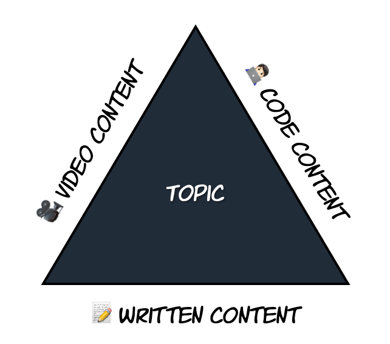

Let's say you create developer content for a living. In that case, chances are that you work in one of those fancy jobs titles like Developer Advocacy, Community Management, Product Technical Marketing, Program Management, and many others. Regardless of your title, what is essential is for you to apply effectiveness to your content, which means that you do want that your content targets the right audience and be as relevant as possible. This blog post will discuss how you can accomplish this by using a technique that I affectionately call the 🔺 triangle. This technique is about making your content focus on the different ways people learn, creating the appropriate relevancy by linking them together, and helping scale the content promotion.

### Efficiency versus effectiveness

Let's start by discussing effectiveness. It may look irrelevant, but it is critical to understand what effectiveness means here. The reality is that many people confuse effectiveness with efficiency. Often, they even use these terms interchangeably. Being efficient is about reducing the amount of time and resources of a given task without affecting the outcome produced. This means building something faster and/or cheaper while achieving the same goal. On the other hand, effectiveness is about using time and resources to produce the right outcome and reach the right goal.

When people create content for developers, the mandate is often being efficient. To illustrate this, let's talk about video content for a minute. Whether you are producing videos on YouTube, Twitch, or other platforms, there is this urge to produce as much content as possible in short periods. The reasons are varied. Maybe the point is to create momentum, and spacing out the time from one video to another is bad. Perhaps you learned from a metric that people are prematurely dropping longer videos, so now you are creating smaller videos and producing a series. All of this is valid, and there is nothing wrong with the approach. But this is all about being efficient. You are not necessarily being effective.

The danger of not being effective is that you consume time and resources to produce content. It may be high-quality content, but it may not be targeting the right audience; or even worse, it may not be helpful to all sorts of people. One recurring complaint from many DevRel programs is why specific technical questions insist on popping up in social forums when technical content for those questions has been created already. It may have been that killer video, the best piece of documentation ever, perhaps a blog post you wrote that is supposed to get you a Pulitzer. The content just failed in being effective.

### Different ways of learning

Why do we fail to be effective while producing developer content? It has to do with assuming that all people learn things the same way. Simply put, this is just not true. Some people learn by 🧑🏻‍💻 doing it, others learn by 🎥 watching, and others prefer 📝 reading. In psychology, experts study the cognitive skills that human beings develop, which helps them acquire, manipulate, process, reason, and store information. Furthermore, these cognitive skills also influence their ability to pay attention. Depending on which learning style is more dominant for a given individual, the content you create may help them acquire and process information faster — but fail to help them reason and store it. You can switch to another format to favor better reasoning and storage but then compromise how fast they acquire and process the information. Yeah, that is a challenging task to tackle. More so if you are trying to address all cognitive skills with a single content.

To better understand this, let's use an example. Say you have written a very detailed blog post. You saved no effort in giving as many details, data, metrics, and explanations for every single aspect of the topic you are discussing. After publishing this post, you expect that whoever reads that blog post will understand in full detail the topic. Then you start noticing two things. First, your blog post's number of views is not as high as you expected. Secondly, you see that the topic that your blog post beautifully explains is still a source of confusion among many people. Even basic questions about the topic are being asked in public forums. This is the time when you start questioning your ability to do anything right.

Not necessarily. Maybe the blog post is just not targeting the right audience. You may be someone that favors the cognitive skill of learning by reading, which even explains why you are so good at writing. Trust me; there is a correlation in this. The same goes for those who like producing videos. They are likely people who instinctively learn better by watching. They can acquire, process, reason, and store more information by watching . Anecdotally, these are the same people who may not enjoy your blog post. 😉

### Not one, but multiple perspectives

Now that you understand the need to create effective content and why most people fail at it, you can better understand what the triangle technique is. As mentioned before, this technique focus on the different ways people learn. It is about creating content that will favor the 🧑🏻‍💻 doers, the 🎥 watchers, and the 📝 readers. This technique, however, doesn't just focus on creating three different versions of the same topic. You must create a closed-loop about the topic explained over three different perspectives, each with the relevant details. This is how you are going to address relevancy.

Meet the triangle. Each vertice represents content that you need to produce in a specific format. In the context of developer content, you will usually focus on the three most common types of content: written form (blog posts, documentation), video, and code. It doesn't really matter which one you will start with, as long you close the loop eventually. As a best practice, always start with the type of content you are most comfortable with. Then, begin producing the others. Ideally, each vertice has the same weight, meaning that the content created will produce the exact details. Each content type can be fully consumed and be as helpful as the others. Remember, the point is to provide an alternative format to the same topic, not use the other formats as continuations of your preferred one.

Besides creating content for each vertice of the triangle, you also need to link them together. Almost as if they were a single deployment unit. This is important because it will help users navigate through your content for more details or just because they are interested in a different format. For example, let's say I am searching for a topic on YouTube and find one video that is part of a three-part content you created. If I am not a video person, I can stop the video but keep my interest with the link to the blog and code you provided. Using this practice of linking will help with scaling the content promotion. Maybe the traffic of unique views to your blog post may not come directly from Google searches or paid advertisement as you expected, but instead, from people using your code on GitHub and willing to know more with the blog post.

Using the triangle technique may help with other things as well. For instance, it will help you validate if your content is easy to digest. It is very common for us to produce developer content in the format that we like the most and think granularity, tone, and rhythm are fine. However, when you create a different version of the content in another format, you notice that telling the story is not as easy as before and doesn't flow as expected. It is an excellent way for you to validate the quality of your work. Ultimately, you will see that creating content becomes easier no matter the format. Another benefit is the natural increase of different formats of content. Your team may have metrics in place that counts the number of content produced in, let's say, a quarter. Perhaps a given format has been slow because the content owners always pick their personal preferences, but now they will work towards other formats and give a boost in the other metrics. Finally, it will help your team to grow their skills and explore other ways to produce content, giving them the opportunity to become better content creators.

### Summary

I hope you liked the idea of the triangle technique, and if you need examples, reach out, and I can provide some. Another blog post will explore a variation of this technique called weighed-triangle. This is where not all triangle vertices have the same size, but instead, each one has a weight. The greater the weight, the more narrative the vertice will contain and drive the other vertices accordingly. A great way to create content for developer portals. Stay tuned.
