In 2010, I purchased my first iRobot Roomba, the 700 series model launched that year. It promised to revolutionize automated cleaning, a claim repeatedly made since the device's initial release in 2002. Unaware of previous models' shortcomings, I was captivated by the promises of this new version. I recall reading about patented features like the Dirt Detect Technology™ and built-in integration with voice assistants. All of which seemed incredibly innovative at the time.

Unsurprisingly, this model disappointed, much like its predecessors. It performed adequately in clutter-free spaces but struggled in areas with numerous obstacles and irregularly shaped objects. This was because of its reliance on previous generations' algorithms for obstacle detection. The basic approach was to circle around obstacles when possible and, if stuck, halt operations and request help from the owner. A scenario that occurred frequently.

Despite its limitations, I continued to use the product for an extended period, devising various strategies to help the robot accomplish its cleaning tasks. Even purchasing additional virtual barriers to confine the robot to a smaller section of the house. For each cleaning session, I would be present to assist, ensuring the desired level of cleanliness was achieved. At times, I found myself pondering whether the effort expended in aiding the robot was equivalent to simply grabbing a broom and cleaning manually.

> _But what does this have to do with AI coding assistants?_

The reality developers currently face with AI tools is not dissimilar to my experience with the iRobot Roomba in 2010. They often spend more time guiding the AI to understand the scope of the task than actually benefiting from the promised ability to focus on more important work. This stands in stark contrast to the claims made in most AI tool advertisements. To illustrate this point, allow me to share a real-world example with you.

## Task: Adding Support for QWERTY

By the end of 2024, I created a code repository called [Hangman Game with Redis](https://github.com/redis-developer/hangman-game-redis). This repository contains a complete source code for you to deploy and play the hangman game with your friends using a browser. It is written in JavaScript, with Redis as backend. It is fun, and I would highly encourage you to use it some of these days. Once deployed, you will be presented with a UI similar to this.

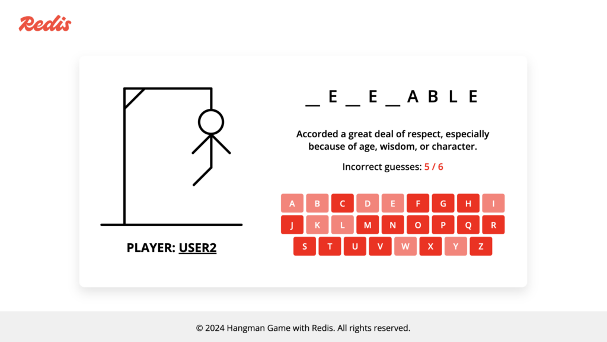

The rest is self-explanatory. By using the virtual keyboard, you can select the letters you think may fill the word being asked. One day, I was sharing this game with my friends at Redis, and one of them shared a need they felt: for the keyboard to follow the [QWERTY](https://en.wikipedia.org/wiki/QWERTY) style so they could rapidly find the letters. They were spot on with this advice. After all, one of the key points of the game is to as quickly as possible to find the letter. By using the QWERTY style, people could type letters even without looking at the keyboard. It was a genius advice. For your reference, this is how a QWERTY style looks like:

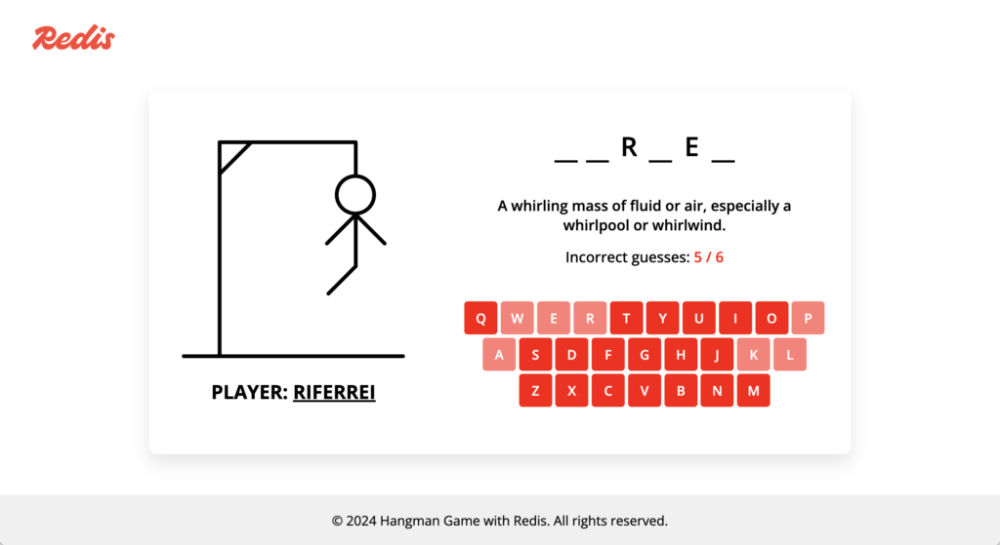

I assigned myself the task of implementing this functionality. I decided to use an AI coding assistant for this task as I deemed low priority at the time, though it would be nice to get it done. I wanted to finish this task as quickly as possible, and don't hassle with something I'm not really good at, which is JavaScript. Unfortunately, the outcome was not what I had hoped. I ended up spending a considerable amount of time guiding the AI coding assistant to comprehend my requirements. To illustrate this experience, I will share screenshots of my conversation with GitHub Copilot.

> _GitHub Copilot was utilized for this task, but my intention is not to disparage Copilot. I am confident that any AI code assistant I might have used for this task would have produced similar results. In fact, I believe Copilot is an excellent product._

**Iteration #1** : I used the AI coding assistant to locate the exact point in the script the keyboard is created. I couldn't find any function for that purpose. Thankfully, it was useful for that purpose.

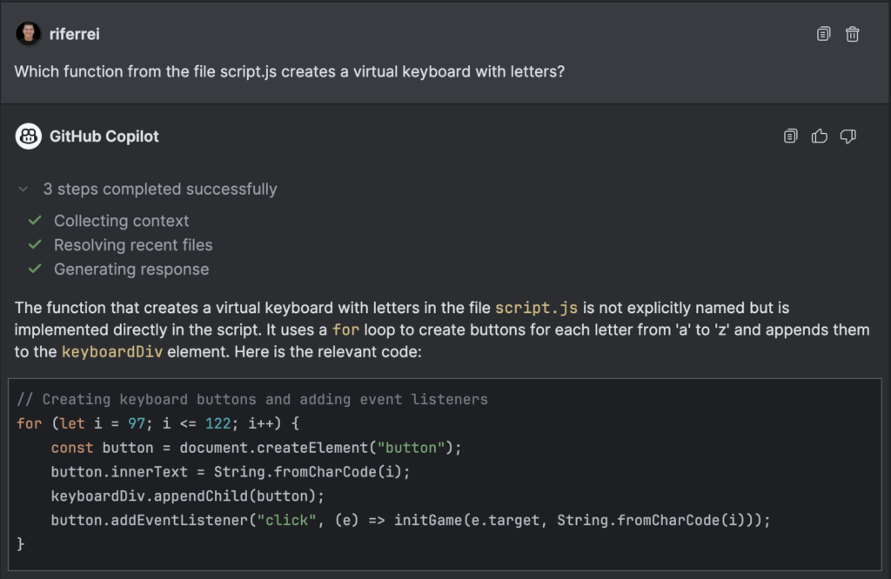

**Iteration #2** : This is where I requested the help with the task. Note that I assumed the AI coding assistant knows how the QWERTY style works and how it looks like.

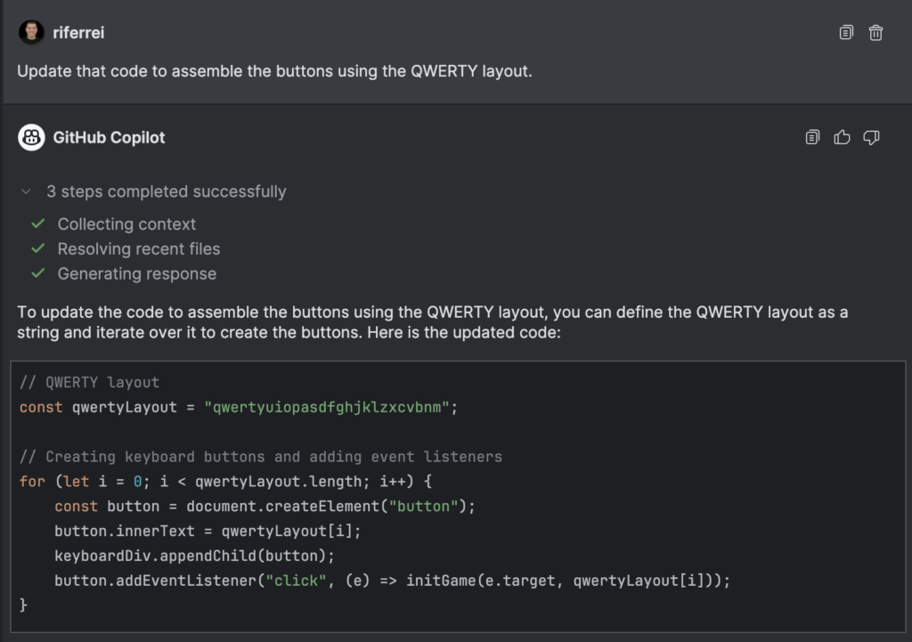

**Iteration #3** : Here I noticed the first hiccup. It implemented the keyboard layout as requested, but visually it didn't look like a real keyboard. Some letters were misplaced because of alignment.

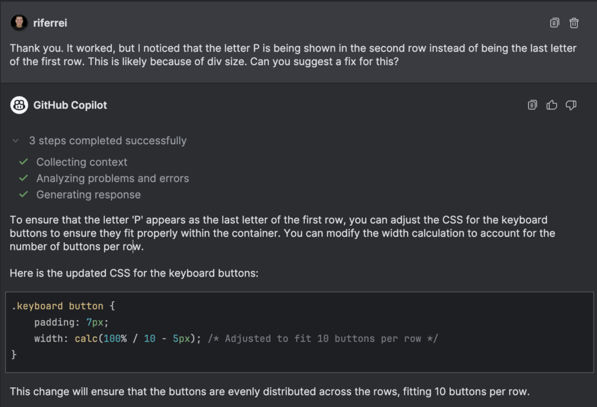

**Iteration #4** : Here is another glitch. It helped me with the previous request, but surely it forgot the main goal of this task, highlighted in the first iteration. I wanted to implement the QWERTY style. At this point, the AI coding assistant was just helping me one prompt at a time, and not taking into consideration the larger picture.

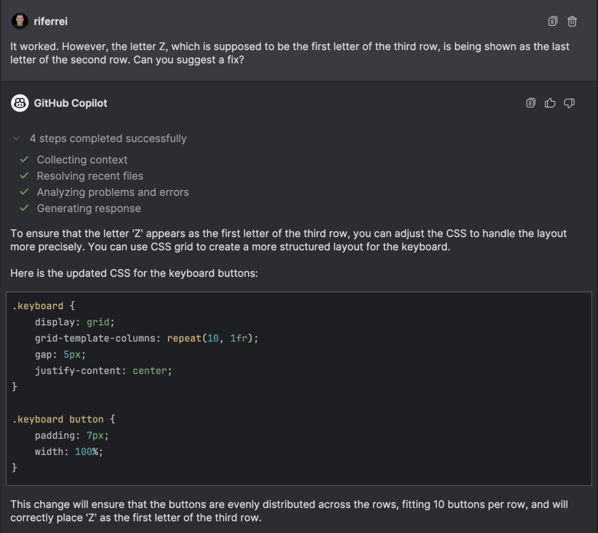

**Iteration #5** : I implemented the changes as instructed, but they didn't work. The letter 'Z' was still being shown as the last letter in the second row.

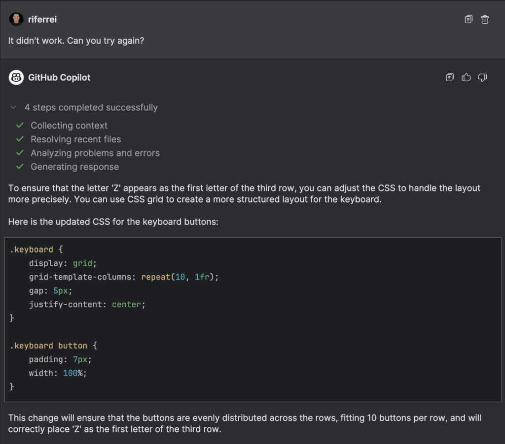

**Iteration #6** : This is where the AI coding assistant hallucinated. It clearly deviated from the primary goal. I stepped back and explain it again my task.

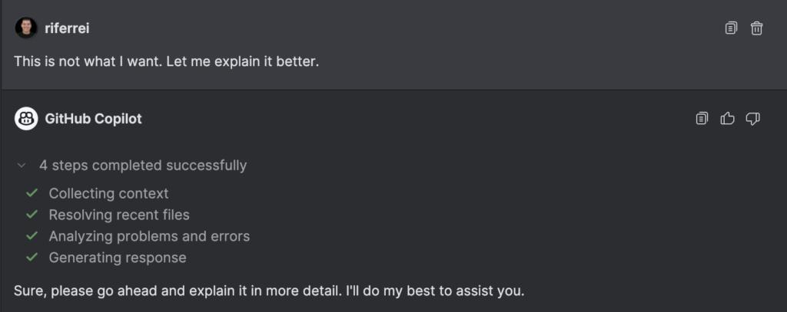

**Iteration #7** : Note how at this point I asked again the same question, but with greater details and even examples that it should follow. I actually spent some time looking through the code to understand the next steps to be taken.

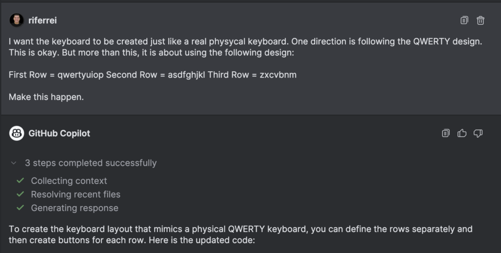 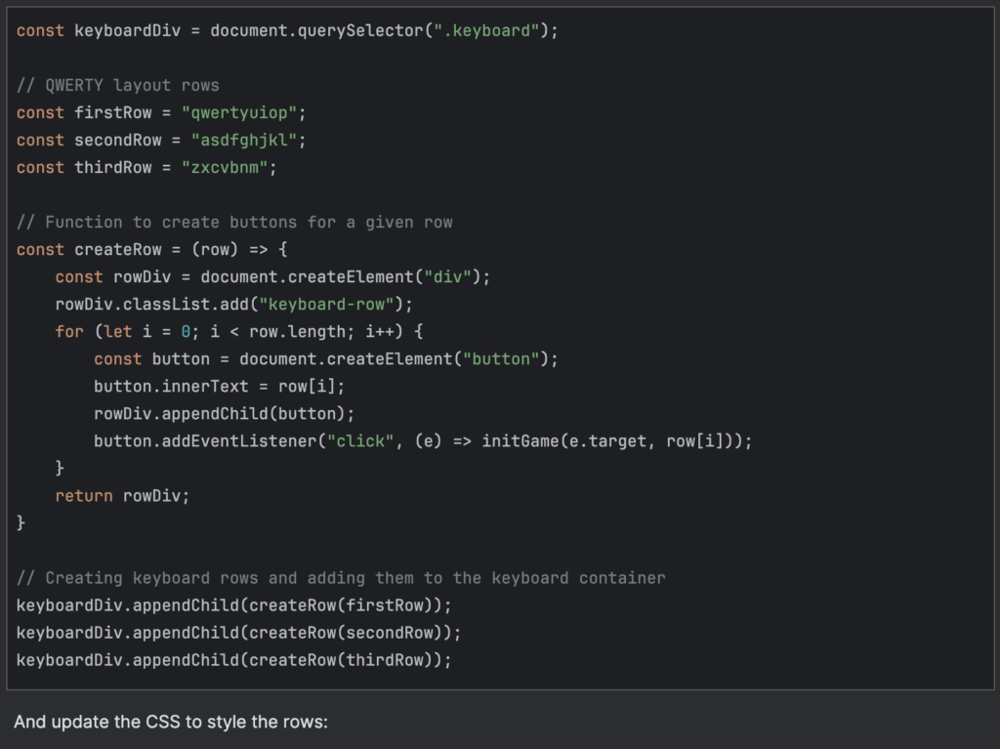 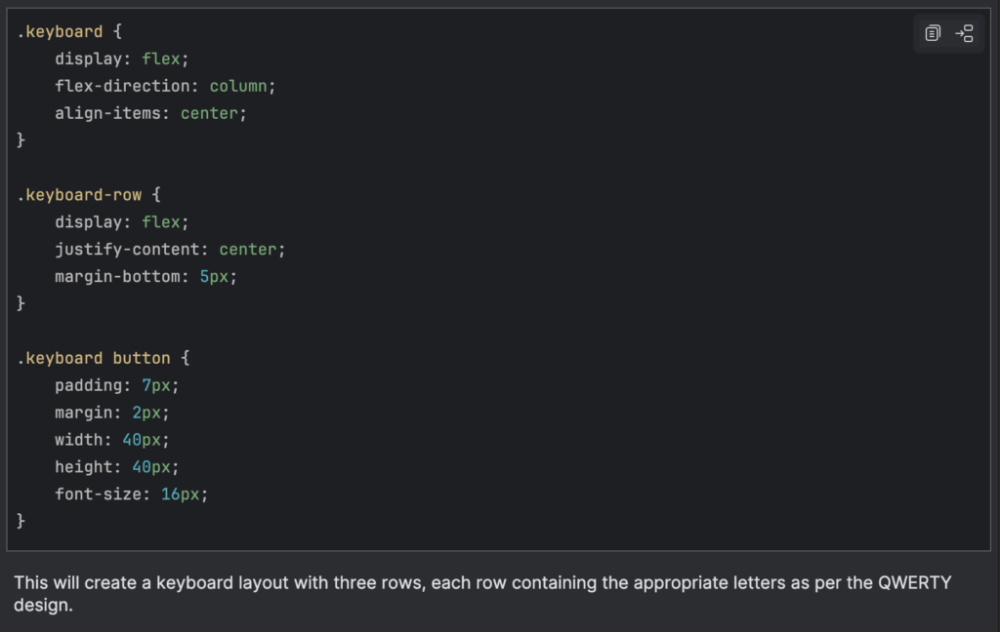

**Iteration #8** : Here, I got one step further but two steps back. Before the changes, I had this functionality where keys from the keyboard could be selected using the user's keyboard. I implemented `keydown()` listeners in the script to handle that. But the name changes suggested by the AI coding assistant broke all up. I would expect that at this point, the AI coding assistant doesn't just suggest code for the sake of suggesting code. But rather, to suggest the code that applies for my code open in the IDE.

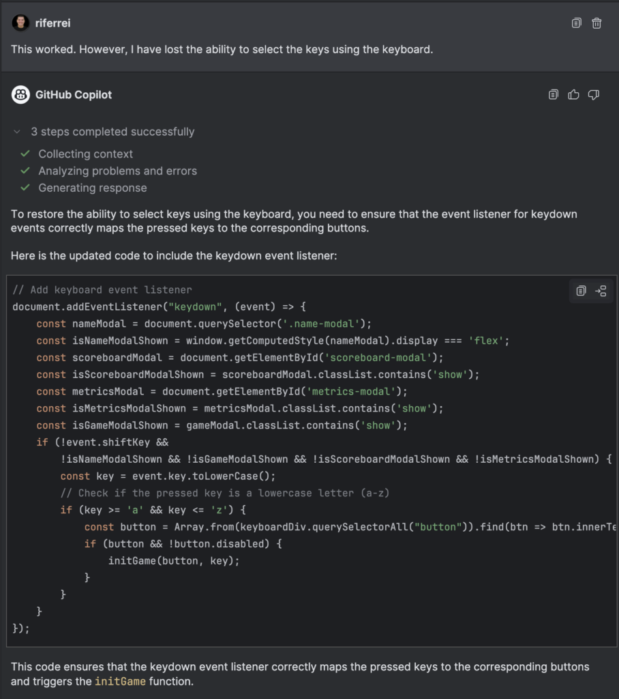

**Iteration #9** : With the previous iteration, I fixed the problem created by the AI coding assistant. Now I had exactly what I wanted. The following iterations were just to learn how to increase the spaces between the letters. More of a CSS type of thing.

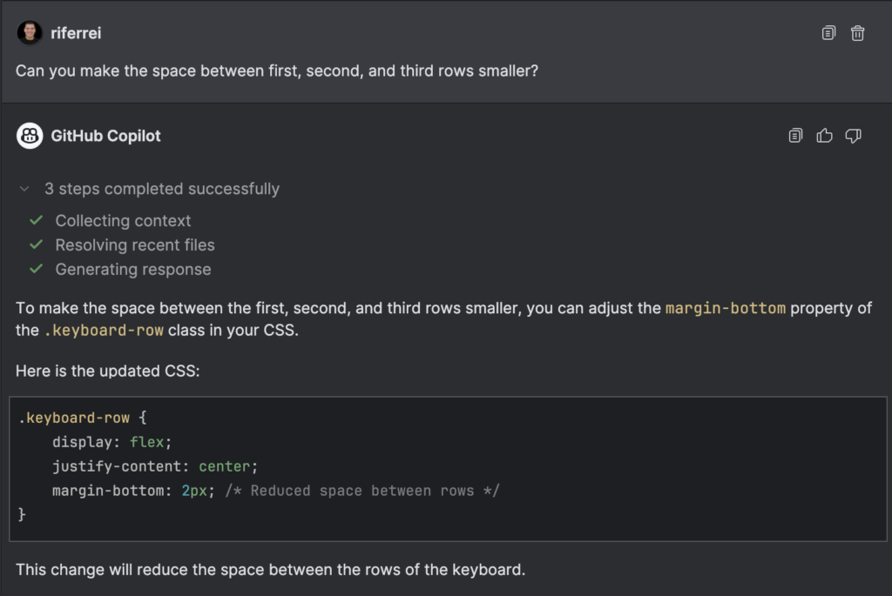

**Iteration #10** : The previous iteration didn't create a space that would look different. Visually, it was essentially the same. So I asked again.

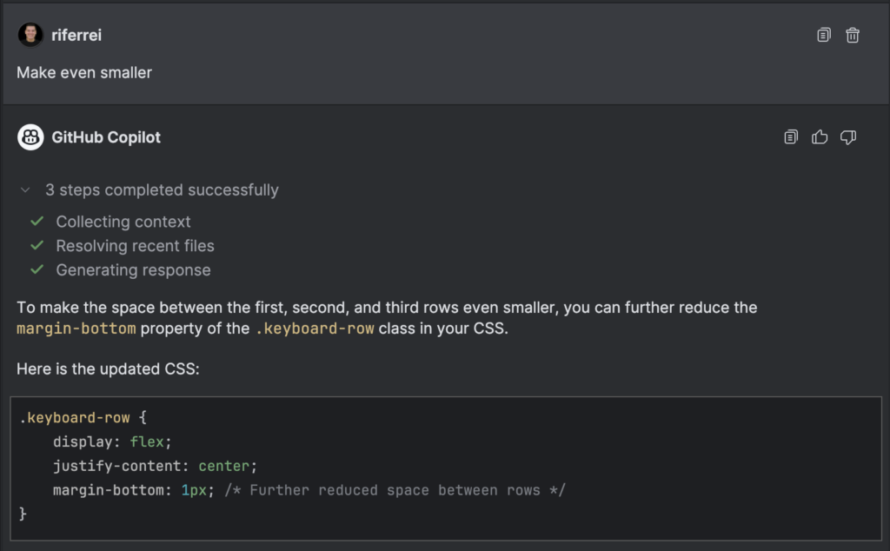

**Iteration #11** : I insisted on the prompt, because I was wondering if the problem was the actual number set in the property margin-bottom.

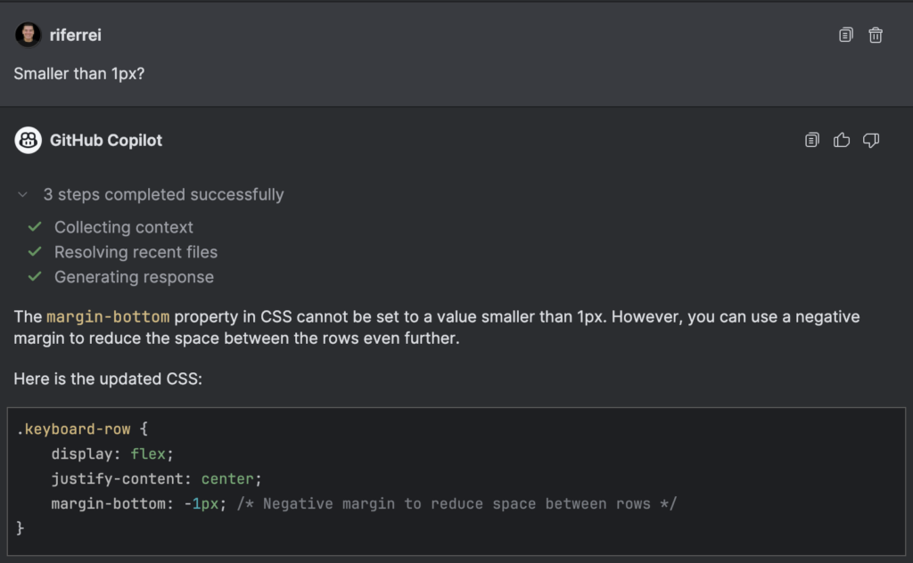

After this, I realized that none of that would work, because there were some other styles being applied and taking precedence over the visual layout. I fixed myself manually, but then I thought: wouldn't be the job of the AI coding assistant to spot things like this given my prompt? It would be nice to have something like:

> _"You know what? let's update this other part of the code because this is what is affecting the visual layout."_

Curiously, if you look from the [code commit](https://github.com/redis-developer/hangman-game-redis/commit/e65f475667c4f8fc08f6a89fe2bfce8841c68b6a) perspective, the number of changes wasn't that big. But that effort to get there certainly wasn't that easy. Even with the help of the AI coding assistant. It required eleven iterations, some serious manual code analysis, and figuring stuff out. For this task, I would be better off doing it all by myself.

## Conclusion

The AI world has inundated developers with promises of unparalleled agility, but these often fall short of expectations. AI coding assistants are still striving to comprehend human requests and provide the code developers' need, but they lack a comprehensive vision of how that code should look and function optimally. They struggle with basic obstacles and frequently require user intervention to progress.

This situation is reminiscent of iRobot Roomba devices prior to 2015. Why 2015, you might ask? This was the year the company introduced the model 980, which used a camera to detect obstacles, effectively providing the device with eyes. The Roomba 980 represented a significant advancement in iRobot's lineup, incorporating a visual localization system called vSLAM (Visual Simultaneous Localization and Mapping). This system employs a low-resolution camera to create a map of the room and track the robot's location within that space. This technology marked a shift from previous random bouncing patterns to a more intelligent, methodical cleaning approach.

For reflection: it took iRobot 13 years (from 2002 to 2015) to realize that the device needed a camera to see obstacles. I sincerely expect it doesn't take that long for AI coding assistants to recognize that circling around obstacles and keep hoping for the best is simply not enough for developers.
