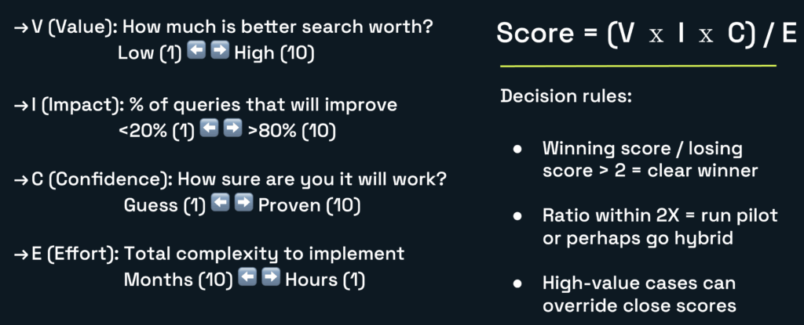

This year, I presented a session at the All Things Open conference called [To Vector, or not to Vector, that is the Question](https://2025.allthingsopen.org/sessions/to-vector-or-not-to-vector-that-is-the-question), and I found myself facing a packed room with people standing in the back. The topic? Whether you actually need a vector database. It seems I wasn't the only one struggling with this question. This session was very well received, and the most unanimous feedback I received after the session was whether a blog about this session would be written or not.

With this blog post, I intend to keep the promises I made during the conference.

### Vector Gold Rush Problem

Here's what's happening right now in our industry: Vector databases have raised hundreds of millions of dollars in funding in the past two years. Every week, there's a new article about how vectors will revolutionize search. OpenAI's embeddings API made semantic search accessible at scale to everyone. And all of a sudden, every technical decision maker wants vectors in their stack.

> _But Ricardo, you currently work for Redis. Doesn't Redis have a vector database?_

Yes, it does. Please don't misunderstand me; I would love for developers to utilize Redis as much as possible when it comes to vector databases. But I am proud of creating long-lasting relationships with developers through honest, thoughtful, and transparent feedback about whether certain technologies should be used.

In my experience, I've also seen teams waste months and hundreds of thousands of dollars implementing vector search for problems that didn't need it. The hard truth is that sometimes, a simple PostgreSQL full-text search that takes two hours to implement is more effective than a complex vector solution that takes two weeks and costs ten times more.

### Hidden Costs Nobody Talks About

Before we dive into when vectors make sense, let's talk about what you're really signing up for because the vendor sales decks won't tell you this.

#### High Embedding Taxes

Every piece of text you want to search needs to be converted into a vector. Using OpenAI's ada-002 model? That's $0.0001 per 1,000 tokens. Sounds cheap until you realize you have 10 million documents that need initial embedding, plus every new document, plus re-embedding when models improve.

I watched a startup's embedding costs go from $500/month to $8,000/month as they scaled. Their infrastructure only went from $200 to $600. The embeddings were the real cost. Another interesting aspect of embedding costs is that they may manifest in various forms. Some developers believe that using local embedding models will decrease the cost, as there will be no API calls to be charged. However, the reality is that local embedding models require additional infrastructure. Creating embeddings is a very CPU-intensive process. Trading API calls for additional infrastructure are often just a maneuver of incurring [CAPEX](https://en.wikipedia.org/wiki/Capital_expenditure) instead of [OPEX](https://en.wikipedia.org/wiki/Operating_expense).

#### Black Box Debugging Nightmare

Traditional search doesn't match? You check your SQL. You look at the keywords. You understand why.

Vector search doesn't match? The 1536-dimensional vectors weren't similar enough in the embedding space. Good luck explaining that to your product manager—or even worse—debugging it at 3 AM when production is down. The reality with vectors is that their effectiveness is no longer the sole responsibility of the data store itself; that can provide tools and frameworks for troubleshooting and optimization. There are several factors that can impact the behavior of searches, including the embedding model version, the number of dimensions, their alignment with index types, and the ease of rebuilding vectors.

#### Version Migration Hell

Here's a fun story: A company spent three months building its perfect vector search. Six months later, OpenAI deprecated the embedding model used during their pilot program. The new model had different dimensions. Different similarity scores. The cost to re-embed everything? $40,000. As you can imagine, these 40K were not welcomed with grace by upper management, who thought the development team should have known beforehand that such an issue could arise. The time to migrate between versions? Two weeks. This means that, along with the infrastructure costs, also came the cost of human capital (developers).

In comparison to traditional search systems, during the same period? Zero changes needed.

### The Four Pillars Framework

Adopting technologies shouldn't be a straightforward decision. If a project is built using a particular approach, that approach must be maintained and consistently applied by the company. This is surely true for any technology, but in the case of technologies like vector databases that are widely adopted, I think developers should be extra cautious. One must avoid looking as if they are finding a problem to justify a solution. We have witnessed this phenomenon with numerous technologies, including serverless, containers, microservices, and SOA.

After witnessing numerous teams make costly mistakes, I developed a framework to address these issues. Four pillars that determine whether you actually need vectors. I originally referred to these as the surviving questions. The idea is for you to answer a set of consecutive questions, one followed by the other, and as you go over them until the end, you achieve one of the following goals: either you prove that you are really in need of that technology, or you get a real sense of how unprepared you are to answer the questions. Either way, they help you to evaluate your readiness.

With time, I separated the questions into different pillars. These pillars are important because they acknowledge that adopting technologies is a decision that involves multiple stakeholders—not only the development teams. Let's review the pillars and their corresponding questions.

#### Pillar 1: Technical Fit

Do you actually need semantic search? This may seem obvious, but you might be surprised at how many teams struggle to answer this.

  * **Is exact matching insufficient?**  If no, stop here. Use traditional databases.
  * **Do relationships matter more than keywords?**  If not, full-text search is enough.
  * **Can you tolerate approximate results?**  If no, you need a hybrid (complexity alert!)
  * **Is similarity search core to your use case?**  If no, reconsider everything.

#### Pillar 2: Economic Viability

Can you afford the true cost? Not just the infrastructure, but everything that entails your implementation.

  * **Is ROI measurement reasonable?** Otherwise, consider whether the headaches are justified.
  * **Can you handle a 10- to 50-fold increase in infrastructure?** Costs with embeddings are unpredictable.
  * **Is the implementation tied to revenue?** Can you easily demonstrate value with the pilot?
  * **3X cost overruns?** Unless you set good, hard limits on your spending, vectors may break the bank.

If improved search doesn't drive real revenue, traditional search is the safer choice.

#### Pillar 3: Operational Readiness

Does your team have what it takes? Working with AI and ML models is not a well-known discipline. Developers are still embracing the culture of working with AI, and until their teams adopt it, they may struggle with its implementation.

  * **Do you have experience in ML/data engineering?** If not, how can you train/hire teams?
  * **Can you debug black-box systems?** Can someone from the team debug hard issues?
  * **Can you handle model version migrations?** If this process is not well-known, teams will struggle.
  * **Do you have on-prem and cloud flexibility?** Does your vector database have both deployment options?

#### Pillar 4: Strategic Alignment

Does this fit your company's future? Or perhaps this vector database is intended for a one-off project? Costly technologies have a far better chance of successful adoption if the company is aware of them and they are being used in multiple projects.

  * **Is search core to competitive advantage?** In other words, can you translate that into business dollars?
  * **Will you scale 10x in 12 months?** If your company is poised for future growth, you may want to consider delaying adoption.
  * **Can you pivot if vectors fail?** Do you have a backup strategy? Or that will require an entirely different development team?
  * **Does this align with your AI strategy?** If vector databases are part of the strategy, you have automatic sponsors for it.

### The VICE Scoring Model: Making It Quantitative

Anecdotes and insights are great, but you must be able to prove the need for a vector database using a data-driven approach. During my tenure at AWS, I had the opportunity to collaborate with consultants from the professional services organization, who helped customers determine if a vector database was the ideal solution for their specific problems. My role as a developer advocate was to provide a more unbiased opinion about the need to use one. Because Developer Relations (DevRel) doesn't really get paid to sell things, customers tend to hear what we have to say with a more open mind.

After a while, I was able to identify some common requirements, struggles, and usage patterns across multiple interactions. I created **VICE** —a scoring model that helps you turn subjectivity into objectivity when adopting vector databases.

Here is how VICE works: you must calculate the score for both approaches you are evaluating. Typically, that involves a traditional search approach and the vector database search approach. Once you have the scores for each, you must use these guiding rules:

  * Winning score ÷ losing score > 2 = clear winner
  * Ratio between scores within 2X = run a pilot or go hybrid
  * If a scenario provides high value, then it wins

In brief, the VICE scoring mode appears to be a straightforward and efficient way to evaluate a decision. After all, how hard can it be to collect four variables and apply them to a formula? Well, in my experience, this is the easy part. Making teams truthfully answer the interview questions without bias is the hard part. I recall instances where teams would ask me to evaluate a scenario, hoping that I would come up with a specific outcome.

It can be tricky. Let me illustrate this with real-world examples.

### Use Case #1: E-commerce Product Search

A mid-size retailer wanted to implement vector search. They sell outdoor gear, comprising approximately 50,000 SKUs. Let's run the numbers with their use case.

#### Traditional Approach (PostgreSQL Full-Text Search)

  * Setup time: 2 hours
  * Query speed: 15ms
  * Accuracy: 75% relevant results
  * Cost: $50/month

#### Vector Approach (Redis Query Engine)

  * Setup time: 2 days
  * Query speed: 5ms + 200ms embedding
  * Accuracy: 95% relevant results
  * Cost: $450/month

#### VICE Scoring

Dimension| Traditional approach| Vector approach| Reasoning
---|---|---|---
Value (1-10)| 6| 8| Vectors enable discovery shopping
Impact (1-10)| 7| 9| Semantic search helps considerably
Confidence (1-10)| 9| 7| Traditional proven, vectors have issues
Effort (10-1)| 2| 6| 2 hours vs 2 days + maintenance

  * **Traditional Score:**  (6 × 7 × 9) / 2 = 189

  * **Vector Score:**  (8 × 9 × 7) / 6 = 84

  * **Winner: Neither!**

The 2.3× ratio suggests a hybrid is best. Use traditional for SKU/brand searches, vectors for discovery. Sometimes this is possible with the existing database technology you are using. PostgreSQL, for example, allows you to install the pgVector extension to enhance the database's search capabilities.

### Use Case #2: Customer Support Ticket Routing

A SaaS company with 10,000 tickets/month wanted to auto-route them to the right team. This is a very common classification problem.

#### Traditional Approach (OpenSearch)

  * Setup time: 4 hours
  * Query speed: 25ms
  * Accuracy: 82% correct routing
  * Cost: $150/month

#### Vector Approach (Weaviate)

  * Setup time: 1 week
  * Query speed: 35ms + 180ms embedding
  * Accuracy: 89% correct routing
  * Cost: $800/month

#### VICE Scoring

Dimension| Traditional approach| Vector approach| Reasoning
---|---|---|---
Value (1-10)| 7| 7| Both route tickets correctly
Impact (1-10)| 8| 8| Affects all tickets equally
Confidence (1-10)| 9| 6| Vectors need constant model updates
Effort (10-1)| 2| 7| 4 hours vs 1 week + complexity

  * **Traditional Score:**  (7 × 8 × 9) / 2 = 252

  * **Vector Score:**  (7 × 8 × 6) / 7 = 48

  * **Winner:**Traditional by 5.25×****

When vocabulary is limited and patterns are predictable, traditional search with good preprocessing wins. This is particularly true for well-established search implementations that users are used to.

### Use Case #3: Legal Document Discovery

A law firm searching through millions of case files. This is where things get interesting.

#### Traditional Approach (Apache Solr)

  * Setup time: 1 week
  * Query speed: 45ms
  * Accuracy: 61% relevant cases found
  * Cost: $200/month

#### Vector Approach (Pinecone)

  * Setup time: 2 weeks
  * Query speed: 55ms + 150ms embedding
  * Accuracy: 94% relevant cases found
  * Cost: $1,200/month

#### VICE Scoring

Dimension| Traditional approach| Vector approach| Reasoning
---|---|---|---
Value (1-10)| 5| 10| Lawyers bill $500/hour
Impact (1-10)| 4| 10| 61% accuracy is terrible for legal
Confidence (1-10)| 10| 9| Both proven; but vectors are better here
Effort (10-1)| 3| 5| Poor traditional needs manual review

  * **Traditional Score:**  (5 × 4 × 10) / 3 = 67

  * **Vector Score:**  (10 × 10 × 9) / 5 = 180

  * **Winner:****Vectors by 2.7×******

When accuracy directly translates to revenue, and your users are high-value, vectors pay for themselves quickly. It shouldn't be hard to find the business value of vector databases if the reason for adopting one came from a customer pain point.

### Emerged Patterns

After running VICE scoring with dozens of customers, clear patterns have emerged. This is how you can almost immediately spot a bad or a good use case for vector databases, only by observing certain characteristics.

#### Vectors Win When:

  * Semantic understanding is crucial (legal, medical, research)
  * Users' time is high-value (lawyers, doctors, researchers)
  * Content is unstructured and varied (hybrid content)
  * Discovery matters more than finding exact items
  * Multi-modal search is needed (text to image)

#### Traditional Wins When:

  * Vocabulary is predictable (support tickets, internal docs)
  * Exact matching is critical (SKUs, IDs, code lookups)
  * The dataset is small (<10K items) and doesn't grow
  * Budget is constrained, your spending must be predictable
  * Team lacks ML expertise. Or traditional search culture is strong

#### Hybrid Wins When:

  * You need both exact and semantic searches
  * Different query types require different approaches
  * You can afford the complexity. It's part of a plan
  * User expectations are very high (Amazon-like)

### Uncomfortable Truth

After all this analysis, here's what I tell teams:

> "The best vector database is the one you don't need. The second best is the one that solves a real problem."

Most teams implementing vectors are solving problems they don't have, with technology they don't understand, at costs they can't afford. But when you genuinely need semantic search—when your users are high-value, when accuracy drives revenue, as well as when traditional search genuinely fails—vectors are transformative. Why is this an uncomfortable truth? Because in my experience, some teams crave complexity even when it is unjustified. While others may have a compelling use case in hand, it requires a significant amount of effort to delve into the necessary details that properly justify the use of a vector database.

### Final Thoughts

The vector database market wants you to believe every search problem needs embeddings. The truth is more nuanced. Sometimes a well-tuned PostgreSQL full-text search is all you need. Sometimes vectors are genuinely transformative. Most of the time, the answer lies somewhere in between.

Use the VICE framework. Run the numbers. Make decisions based on data, not hype. Ultimately, your users don't care whether you're using vectors or not. They care if the search works.
